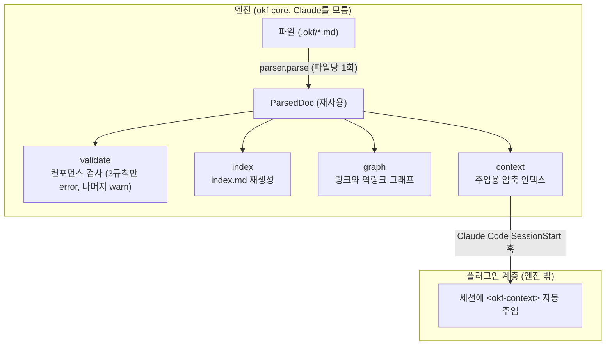

# okf-wiki-plugin

**오픈소스예요. 지식이 내 컴퓨터에, 내 소유로, Markdown 파일 그대로 남아요.**

[OKF(Open Knowledge Format) v0.1](okf-core/vendor/spec/SPEC.md) 지식 번들을 만들고
검증해서 Claude Code 세션에 넣어 주는 도구예요. 에이전트가 세션마다 맨땅에서 다시
시작하지 않도록, 한 번 알아낸 걸 `cat` 한 번이면 읽히는 markdown에 적어 git으로
관리하거든요. 그러면 다음 세션이나 다른 에이전트가 그 지식을 그대로 이어받아요.

> **비공식 고지.** 이 프로젝트는 Google과는 관계없는 비공식 도구예요. OKF 스펙
> 원문은 Apache-2.0 라이선스 그대로 고치지 않고 가져왔고([THIRD_PARTY_NOTICES.md](THIRD_PARTY_NOTICES.md)),
> 코드는 MIT예요([LICENSE](LICENSE)).

## 목차

- [구성](#구성)
- [왜 okf-wiki-plugin인가](#왜-okf-wiki-plugin인가)
- [Getting Started](#getting-started)
- [동작 방식](#동작-방식)
- [단기 기억과 장기 기억 (`study`)](#단기-기억과-장기-기억-study)
- [신뢰 경계와 스코프](#신뢰-경계와-스코프)
- [일상 명령](#일상-명령)
- [데이터와 프라이버시](#데이터와-프라이버시)
- [문서](#문서)
- [라이선스](#라이선스)

## 구성

크게 네 조각이에요. 지식을 파싱하고 검증하고 색인하는 **엔진**이 `okf-core/`에 있고,
`okf` CLI도 여기 들어 있어요. Claude Code에 붙는 **플러그인**은 `plugins/okf/`에
있는데, 스킬이랑 세션에 컨텍스트를 넣어 주는 훅, 그리고 `study` 승격을 맡아요.
나머지 둘은 이 번들을 가져다 쓰는 repo를 위한 거예요. `actions/validate/`는 CI에서
쓰는 composite action이고, `.pre-commit-hooks.yaml`은 pre-commit 훅 정의예요.

## 왜 okf-wiki-plugin인가

세션이 끝나면 맥락이 사라지고, 다음 에이전트는 또 처음부터 시작하죠. okf는 한 번
알아낸 걸 `.okf/` git 번들 안에 **개념**으로 남겨 둬요. 그러면 다음 세션이든 다른
에이전트든 그대로 이어받을 수 있어요.

개념에는 설명이 아니라 바로 쓸 수 있는 **답**을 담아요. 스키마 컬럼이나 조인 키,
명령어, 수치 같은 것들요. 근거가 코드나 대화, 문서 여기저기 흩어지지 않게 백링크와
인용으로 이어 두고요.

포맷은 그냥 `cat`으로 열리는 markdown에 YAML frontmatter를 얹은 거예요. git으로
배포하니까 특별한 SDK도, 스키마 레지스트리도, 중앙 서버도 필요 없어요(OKF v0.1이
그렇게 설계돼 있어요). 지식이 특정 도구나 SaaS 포맷에 갇힐 일이 없죠.

메모리는 원래 금방 사라지고 취향이랑 지식이 뒤섞이기 쉬운데, `study`가 그중에서
오래 남길 지식만 골라 개념으로 올려 줘요. 못 올라간 후보는 잠깐 쌓였다가 흘려보내면
그냥 사라지고요.

커밋된 설정 파일이 마음대로 코드를 실행하면 위험하잖아요. 그래서 핸들러는 로컬에서
한 번 trust 승인을 받아야만 돌아가요. 새로 클론하면 늘 미승인 상태에서 시작하고요.

마지막으로, 형식이 흔들리면 이걸 가져다 쓰는 쪽이 조용히 깨질 수 있어요. `okf validate`의
컨포먼스 검사에 CI의 픽스처 스냅샷과 오라클 차동까지 더해서, 그런 회귀를 막아 둬요.

## Getting Started

첫 개념 하나를 남기고, 그게 다음 세션에 자동으로 들어가는 것까지 확인해 볼게요.
다섯 단계, 5분쯤 걸려요.

준비물은 Claude Code랑 지식을 담아 둘 git repo 하나예요. 엔진은 플러그인에 같이
들어 있어서 따로 설치할 건 없어요.

### 1. 플러그인 설치

```
/plugin marketplace add pmmm114/okf-wiki-plugin
/plugin install okf@okf-wiki-plugin
```

### 2. 번들 초기화

지식을 담을 repo에서 실행해요. 여러 번 돌려도 안전하고, 이미 있는 파일은 안 건드려요.

```
/okf-init
```

이때 이런 파일들이 생겨요.

| 파일 | 하는 일 | git |
| --- | --- | --- |
| `.okf/` | 지식 번들(개념과 index, log). 없을 때만 새로 만들어요 | 커밋 |
| `.okf-wiki.json` | 프로젝트 설정(주입과 `study`). 있으면 살려서 보강해요 | 커밋 |
| `.okf-study/.gitignore` | 런타임 파일을 git에서 빼는 규칙 | 커밋 |
| `.okf-study/study.db`(+WAL) | 후보 큐와 원장, 이벤트 저널(SQLite) | gitignore |
| `.okf-study/trust` | 핸들러 로컬 승인 해시 | gitignore |

> git repo가 아닌 곳이면 가드가 막아요(exit 3). 그럴 땐 대신 vault repo를 목적지로
> 정하면 되는데, 방법은 [study 도입 가이드](docs/adopting-study.md)에 있어요.

### 3. 세션 주입 켜기

repo 루트의 `.okf-wiki.json`에 주입 설정이 들어 있는지 봐요.

```json
{
  "bundlePath": ".okf",
  "context": { "maxChars": 8000 },
  "inject": true
}
```

이 파일이 있어야 SessionStart 훅이 번들 요약을 세션에 넣어 줘요. 없으면 훅은 그냥
가만히 있어요. 지식 번들이 없는 평범한 repo에서 하는 작업엔 끼어들지 않거든요.
설정 항목 전체는 [CONFIG.md](plugins/okf/skills/okf/reference/CONFIG.md)에 있어요.

### 4. 첫 개념 작성

개념에는 설명이 아니라 **답**을 담아요. 스키마 컬럼이나 조인 키, 명령어, 수치처럼
다음 세션이 바로 꺼내 쓸 수 있는 것들요. 한 파일에 개념 하나씩, 주제별
하위디렉토리로 묶어 두면 돼요.

`.okf/deploy/release.md`는 이런 식이에요.

````markdown
---
type: concept
title: Release
description: 릴리스 컷 명령과 승인 게이트.
---

# 릴리스 컷

```
make release VERSION=x.y.z
```

- 승인자: 2명 이상
- 롤백 창: 배포 후 30분
````

지킬 규칙은 세 개뿐이에요. frontmatter에 `type`을 꼭 넣고, `description`은 한 문장으로
쓰고, 주제별 하위디렉토리에 두는 거예요. Claude한테 "이 내용을 개념으로 적재해줘"라고
하면 okf 스킬이 이 규칙대로 써서 자리를 잡고 index까지 다시 만들어 줘요.

### 5. 검증하고 주입 확인

Claude한테 "번들 검증해줘"라고 하면 스킬이 검사기를 돌려요. 통과하면 이렇게 나와요.

```
컨포먼트: error 0건, warn 0건
```

이어서 "주입될 컨텍스트 보여줘"라고 하면 압축된 인덱스를 그대로 보여 줘요.

```
<okf-context>
deploy/release.md [concept] — 릴리스 컷 명령과 승인 게이트.
</okf-context>
```

이 블록이 다음 세션을 열 때 그대로 들어가는 텍스트예요. 새 세션을 하나 열어서
확인해 보세요. 여기까지 왔으면 한 바퀴가 다 돈 거예요. `.okf/`를 커밋해 두면 팀도,
다음 세션도 이 지식을 그대로 이어받아요.

지금 있는 위치에서 캡처랑 주입이 어디로 가는지 궁금하면 `/okf-doctor`로 확인해요.

### 다음 단계

- git이 아닌 폴더에서 쓰거나 vault repo에 모으고 싶다면 → [study 도입 가이드](docs/adopting-study.md)
- 메모리를 후보로 쌓아 두고 골라서 승격하고 싶다면 → [단기 기억과 장기 기억](#단기-기억과-장기-기억-study)
- 가져다 쓰는 repo에 CI랑 pre-commit 검사를 걸고 싶다면 → [소비 repo 가이드](docs/consuming.md)

## 동작 방식

엔진은 파일 하나를 딱 한 번만 파싱해요. `parser.parse`가 만든 `ParsedDoc`을 validate와
index, graph, context가 돌려쓰거든요(다시 파싱하지 않도록 호출 카운터 테스트가 막고
있어요). 세션에 넣는 일은 플러그인 쪽이 맡아요. 엔진(`okf-core/`)은 Claude를 몰라요.



여기서 몇 가지가 중요해요.

- 파싱은 한 번만 하고 그 결과를 계속 재사용해요. validate와 index, graph, context가 같은 `ParsedDoc`을 함께 봐요.
- error로 막는 건 컨포먼스 규칙 중 세 개뿐이에요. 스펙이 "거부하라"고 하는 것만 error고 나머지는 warn인데, `--strict`를 켜면 권장 필드 위반도 error로 올라가요. 어떤 게 error인지 같은 판정 기준은 코드에 흩뿌리지 않고 [`rules/v0_1.json`](okf-core/src/okf_core/rules/v0_1.json) 한 곳에 모아 놨어요.
- index가 쓰는 파일과 validate를 통과한 파일은 항상 같아요. 이 약속 덕분에 색인 로직을 바꾸면 검증 판정도 같이 움직여요.
- 세션에 넣을 땐 번들 전체가 아니라 `context`가 만든 압축 인덱스만 `<okf-context>` 블록에 담아요. 글자 수 상한은 `.okf-wiki.json`에서 조절하고요.
- 그리고 `.okf-wiki.json`이 없는 repo에서는 훅이 아무것도 안 해요.

## 단기 기억과 장기 기억 (`study`)

`study`는 Claude Code의 메모리(잠깐 있다 사라지는)를 알아채서, 이 repo의 OKF 지식
개념(오래 남는)으로 골라 올려 주는 기능이에요. 올라간 개념은 소비처가 붙여 둔 핸들러로
흘러가요. 플러그인은 그게 어디로 가는지 몰라요. "어디로 보낼지"는 소비처가 정하거든요.

| 계층 | 어디에 저장되나 | 얼마나 사나 |
| --- | --- | --- |
| 단기 메모리 | Claude Code 메모리 | 세션 끝나면 사라져요 |
| 캡처 스테이징 | `.okf-study/study.db`(SQLite, gitignore)와 `trust` | 흘려보내면 소모돼요 |
| 장기 지식 개념 | `.okf/` git 번들과 `log.md` | git으로 버전 관리, 계속 남아요 |

지식과 이력의 진짜 원본은 언제나 번들과 `log.md`, git이에요. 스테이징은 잠깐 쓰고
버리는 상태라 흘려보내면 없어지는데, 승격할 때 캡처한 날짜랑 몇 번 다시 나왔는지를
`log.md`에 적어서 git에 남겨 둬요.

자동으로 점수를 매기거나 알아서 병합하는 건 없어요. 승격은 사람과 모델이 판단해요.
사용자가 만지는 손잡이는 캡처 단계 하나뿐인데, `off`에서 `review`, `auto`로 갈수록
더 적극적으로 잡아요. 어떤 기준으로 고르는지, 재등장은 어떻게 세는지 같은 자세한
이야기와 도입 절차는 [study 도입 가이드](docs/adopting-study.md)에 있어요.

## 신뢰 경계와 스코프

올라간 개념을 소비처 핸들러로 넘겨서 실행하려면, 로컬에서 한 번 승인을 받아야 해요.
커밋되는 `.okf-wiki.json`만으로는 코드가 돌지 않게 막는 장치예요. `/study --trust`로
승인하면 핸들러 내용의 해시가 `.okf-study/trust`(gitignore돼요)에 저장돼요. 그래서
새로 클론하면 늘 미승인 상태로 시작하고, 스크립트나 설정이 바뀌면 다시 승인해야 해요.

그럼 지식은 어디에 쌓일까요? 규칙은 간단해요. 그 repo에 자기 `study` 설정이 있으면
거기(Project)에, 없으면 vault(User)에 쌓여요. Project 스코프면 런타임이랑 trust도 repo
안에 있고, 그렇지 않으면 vault repo로 모아요. git이 아닌 폴더에서도 vault로 보낼 수 있어요.

정확한 해소 규칙은 [CONFIG.md](plugins/okf/skills/okf/reference/CONFIG.md)에, vault로
모으는 방법은 [study 도입 가이드](docs/adopting-study.md)에 자세히 있어요.

## 일상 명령

플러그인은 슬래시 커맨드로 써요.

```
/okf-init [--vault <path>]                         # 번들이랑 런타임 세팅(여러 번 돌려도 안전). vault 포인터 마법사
/study    [<topic> | --type T | --scope vault|project | --clear | --trust]
                                                  # 후보를 골라 지식 개념으로 승격
/okf-doctor                                       # 지금 위치에서 스코프가 어떻게 풀리는지, 건강 상태 진단
```

엔진 `okf` CLI는 스킬이 알아서 불러 주니까 직접 칠 일은 거의 없어요. CI나 pre-commit,
기여할 때 직접 부르는 방법은 [CONTRIBUTING.md](CONTRIBUTING.md)에 정리해 뒀어요.

## 데이터와 프라이버시

- 지식은 전부 여러분의 git repo(`.okf/`) 안에 있어요. 중앙 서버도, SaaS도, 텔레메트리도 없어요.
- 진짜 원본은 git이에요. 지식과 이력은 번들과 `log.md`, git에 남고, 스테이징(`study.db`, WAL, `trust`)은 gitignore된 잠깐 쓰는 파일이라 커밋되지 않아요.
- 밖으로 내보내는 핸들러 코드는 로컬 승인을 받아야 돌아가요. 새로 클론하면 미승인 상태라, 커밋된 설정만으로는 코드가 실행되지 않아요.
- 계층이 나뉘어 있어요. 엔진은 Claude를 모르고, 플러그인은 지식이 어디로 가는지 몰라요. "어디로 내보낼지"는 소비처가 자기 repo에 커밋한 핸들러로 정해요.
- vault로 모을 때도 vault repo에는 잠깐 쓰는 런타임을 만들지 않아요. 그건 유저 스코프에 따로 떼어 둬요.

## 문서

더 자세한 내용은 여기 있어요.

| 문서 | 무슨 내용인지 |
| --- | --- |
| [study 도입 가이드](docs/adopting-study.md) | 설치부터 핸들러 계약, trust, vault로 모으기까지 |
| [CONFIG.md](plugins/okf/skills/okf/reference/CONFIG.md) | `.okf-wiki.json` 설정 항목 전체와 스코프 해소 규칙 |
| [소비 repo 가이드](docs/consuming.md) | 가져다 쓰는 repo에서 CI와 pre-commit으로 검증하기 |
| [CONTRIBUTING.md](CONTRIBUTING.md) | 컨포먼스와 회귀 계약, 엔진 CLI, 로컬에서 재현하기 |
| [OKF v0.1 스펙](okf-core/vendor/spec/SPEC.md) | 스펙 원문(고치지 않고 가져옴) |
| [docs/branching.md](docs/branching.md) | 브랜치와 커밋, 머지, 벤더 반영 전략 |
| [docs/releasing.md](docs/releasing.md) | 배포와 버전 관리 |
| [CLAUDE.md](CLAUDE.md) | 에이전트가 지켜야 할 작업 규칙 |
| [.okf/](.okf/index.md) | 엔진이 스스로 쌓은 번들(아키텍처, 벤더 정책, 컨포먼스 결정) |
| [THIRD_PARTY_NOTICES.md](THIRD_PARTY_NOTICES.md) | 벤더로 가져온 것들의 출처와 라이선스 |

## 라이선스

MIT예요([LICENSE](LICENSE)). 벤더로 가져온 것들의 출처와 라이선스는
[THIRD_PARTY_NOTICES.md](THIRD_PARTY_NOTICES.md)에 적어 뒀어요.
