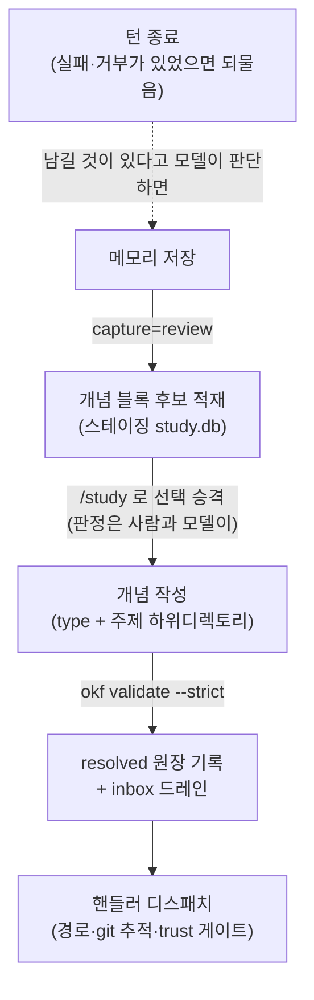

# study 도입 가이드 (소비 repo)

`study`는 Claude Code 메모리(세션이 끝나면 사라지는 일시적인 기억)를 감지해 후보로 쌓아 두고, 그중 오래 남길 것만 골라 이 repo의 OKF 지식 개념으로 승격한 다음, 소비처가 주입한 핸들러로 흘려보내는 기능입니다. 이 문서는 그 도입 절차를 설치부터 설정, 핸들러 계약, trust 승인, vault 폴백까지 순서대로 다룹니다. 플러그인은 지식이 어디로 가는지 모릅니다. "어디로 보낼지"는 소비처가 제공하는 핸들러가 정합니다.

> **근거.** 기능의 설계와 범위는
> [Epic #72](https://github.com/pmmm114/okf-wiki-plugin/issues/72)에 있습니다.

## 목차

- [1. 설치와 초기화](#1-설치와-초기화)
- [2. 설정 파일 `.okf-wiki.json`](#2-설정-파일-okf-wikijson)
- [3. 사용 흐름](#3-사용-흐름)
- [4. 핸들러 계약](#4-핸들러-계약)
- [5. trust 승인](#5-trust-승인)
- [6. 참조 핸들러 템플릿](#6-참조-핸들러-템플릿)
- [7. vault 폴백](#7-vault-폴백)
- [요약](#요약)
- [관련 문서](#관련-문서)

## 1. 설치와 초기화

```
/plugin marketplace add pmmm114/okf-wiki-plugin
/plugin install okf
/okf-init
```

`/okf-init`은 여러 번 실행해도 안전하고, 이미 있는 파일을 덮어쓰지 않습니다. 다음 세 가지를 만듭니다.

| 만드는 것 | 하는 일 |
| --- | --- |
| `.okf/` | 지식 번들입니다. 없을 때만 새로 스캐폴드합니다 |
| `.okf-wiki.json` | 프로젝트 설정입니다. 이미 있으면 `study` 블록만 보강합니다 |
| `.okf-study/` | 런타임 상태 디렉터리와 자체 `.gitignore`(`*` + `!.gitignore`)입니다 |

`.okf-study/` 안의 파일은 커밋되지 않습니다. 후보와 원장, 저널을 담는 스테이징 파일 `study.db`와 그 WAL 사이드카, 그리고 `trust`는 모두 git에서 빠지고 무시 규칙만 커밋됩니다.

## 2. 설정 파일 `.okf-wiki.json`

```json
{
  "study": {
    "capture": "review",
    "handlers": [{ "name": "kb-pr", "command": "scripts/okf-open-pr.py" }]
  }
}
```

사용자가 직접 만지는 설정 항목은 `capture` 하나뿐입니다. `off`에서 `review`, `auto`로 갈수록 후보를 더 적극적으로 잡고, 뒤 단계는 앞 단계가 하는 일을 그대로 포함합니다.

| `capture` | 이렇게 동작합니다 |
| --- | --- |
| `off` (기본값) | 훅이 아무 일도 하지 않습니다. `/study`로 직접 승격합니다 |
| `review` (권장) | 메모리를 저장할 때 후보만 스테이징 저장소(`.okf-study/study.db`)에 쌓아 둡니다. `/study`로 검토해서 승격합니다 |
| `auto` | `review`가 하는 일에 더해, 살아 있는 세션이 후보를 직접 처리합니다. 모델 개입과 trust 승인이 필요합니다 |

`handlers[].command`는 git에 커밋된 repo 안의 경로여야 합니다. 정확한 조건은 [핸들러 계약](#4-핸들러-계약)에, 실행에 필요한 승인은 [trust 승인](#5-trust-승인)에 있습니다.

설정 항목 전체 스키마는 [CONFIG.md](../plugins/okf/skills/okf/reference/CONFIG.md)에 있습니다.

## 3. 사용 흐름



- 턴 종료의 되물음은 **관측만** 합니다. 무엇이 지식인지 판정하지도, 후보를 직접 쌓지도 않습니다. 막힌 자리가 몇 건이었는지만 세어 돌려주고, 남길지와 무엇을 남길지는 모델이 정합니다. 남긴 메모리는 위 흐름의 첫 칸으로 들어옵니다. 그 턴에 실패도 거부도 없었으면 아무 말도 하지 않습니다.
- `/study` — 후보를 전부가 아니라 선택적으로 승격합니다. `/study <topic>`이나 `/study --type X`로 범위를 좁힐 수 있습니다.
- `/study --clear` — 지금 쌓여 있는 후보를 전부 버립니다. 같은 후보가 다시 적재되지 않도록 원장에 기록해 둡니다.
- 카테고리는 승격 시점에 붙이는 `type`(필수)과 주제 하위디렉토리로 정합니다. `tags`로 정하지 않습니다.

### 지식을 꺼내 쓰는 쪽 — 주입은 신호, 세부는 조회

세션 시작 주입은 저장고에 **무엇이 있는지**를 알리는 신호입니다. 규모가 예산에 들면 개념 목록이, 넘으면 축 윤곽이 들어오고(`context.maxChars`가 그 전환점입니다) 어느 쪽이든 마지막 줄에 조회 입구가 붙습니다. 세부는 그 자리에서 SQL로 팝니다.

```bash
# 같은 층에 무엇이 있는지 (승격 전 존재 대조와 같은 레시피)
okf query .okf - <<'SQL'
SELECT v.path, v.summary FROM valid v
JOIN axis_value a ON a.path = v.path AND a.axis = 'layer' AND a.value = 'wisdom'
ORDER BY v.path
SQL
```

레시피 정본은 플러그인 스킬의 `reference/QUERY.md`이고, 새 조회가 필요하면 코드를 짜지 말고 그 문서에 SQL을 한 줄 더합니다(문서의 모든 `sql` 블록은 게이트가 실제 번들에서 실행합니다).

이 스니펫을 소비 repo의 `CLAUDE.md`에 옮겨 적지는 **않기를 권합니다.** 규격이 복제되면 정본이 바뀔 때 사본이 조용히 낡습니다 — 스킬이 이미 조회 경로를 안내하므로, 필요하면 여기를 가리키기만 하면 됩니다.

## 4. 핸들러 계약

핸들러는 훅과 같은 모양의 실행 파일입니다. 승격된 개념 하나마다 한 번씩 호출됩니다.

**입력 — stdin.** 승격된 개념 하나를 담은 study 아이템 JSON이 표준입력으로 들어옵니다.

```json
{
  "source": "manual",
  "project": "/abs/repo",
  "concept": { "path": ".okf/<...>.md", "type": "<type>", "topic": "<주제-디렉토리>", "layer": "knowledge" }
}
```

**입력 — 환경변수.** JSON을 파싱하지 않고도 꺼내 쓸 수 있도록 같은 값을 환경변수로도 넘깁니다.

| 환경변수 | 담기는 값 |
| --- | --- |
| `OKF_TRIGGER` | 무엇이 승격을 일으켰는지 — 현재 `manual` 하나입니다 |
| `OKF_CONCEPT_PATH` | 승격된 개념 파일의 경로 |
| `OKF_CONCEPT_TYPE` | 개념의 `type` |
| `OKF_CONCEPT_TOPIC` | 개념이 놓인 주제 하위디렉토리 |
| `OKF_CONCEPT_LAYER` | 인식층 값 — `information` / `knowledge` / `wisdom` (각각 정보 · 지식 · 지혜) |
| `OKF_PROJECT` | 승격 대상 repo 루트 |

나머지 계약은 네 가지입니다.

- **실행 위치(cwd)** — 핸들러는 승격 대상 repo 루트에서 실행됩니다. 이 경로는 `OKF_PROJECT`, stdin의 `.project`와 같은 값입니다. URL vault를 쓰면 이 repo가 관리형 clone이라 호출자의 cwd와 달라지므로, 핸들러는 호출자 위치를 가정하지 말고 cwd나 `OKF_PROJECT`를 기준으로 git 작업을 해야 합니다.
- **종료코드** — `0`이면 성공이고, 0이 아니면 실패입니다. 실패는 디스패처가 격리하므로 나머지 핸들러에는 영향이 없습니다.
- **위치 요건** — `command`는 repo 트리 안에 있으면서 git이 추적하는 경로여야 합니다. `.okf-study/` 하위 경로와 추적되지 않는 파일, 심링크나 `..`로 repo 밖을 가리키는 경로는 거부합니다. 조건을 만족하는지 확실하지 않으면 통과시키지 않는 fail-closed 방식입니다.
- **격리 요건(URL vault)** — 관리형 clone은 유저 스코프에 하나뿐인 자원입니다. 핸들러가 그 체크아웃의 브랜치를 바꾸거나 커밋하지 않은 잔재를 남기면 이후 신선도 갱신(ff)이 막힙니다. 그래서 URL vault용 핸들러는 `git worktree`로 임시 워크트리를 만들어 거기에서 브랜치를 만들고 커밋·push한 다음 워크트리를 제거합니다. clone의 체크아웃은 절대 건드리지 않습니다. 이 방식은 [참조 핸들러 템플릿](#6-참조-핸들러-템플릿)이 그대로 보여 줍니다.

> **근거.** 핸들러의 실행 cwd를 승격 대상 repo 루트로 고정한 것은 #153 U2-4입니다.

## 5. trust 승인

핸들러를 실행하려면 반드시 로컬에서 한 번 승인을 받아야 합니다. 커밋되는 `.okf-wiki.json`만으로 코드가 실행되는 일을 막는 게이트입니다.

```
/study --trust
```

- 승인 결과는 핸들러 셋 내용의 해시로 `.okf-study/trust`에 저장됩니다. 이 파일은 gitignore되는 로컬 파일이라, 새로 클론하면 언제나 미승인 상태에서 시작합니다.
- 해시의 입력은 핸들러 `name`과 정규화한 경로, 스크립트 바이트의 SHA-256, 그리고 `capture` 값입니다. 스크립트 내용이나 핸들러 셋, `capture`가 바뀌면 다시 승인해야 합니다.
- 승인하지 않은 상태에서 `auto`를 켜 두어도 조용히 실패하지 않습니다. 눈에 보이게 알려 주고 멈춥니다. 개념은 로컬 번들에 그대로 승격되고 검증까지 마치며 핸들러 실행만 보류되고, 디스패치 결과가 `reflected: false` + `blockers[].code = untrusted`로 옵니다 — 커맨드는 그 항목의 `recovery`를 그대로 보여 줍니다.

## 6. 참조 핸들러 템플릿

계약을 실제 코드로 실증한 예시가 [`examples/okf-open-pr.py.example`](examples/okf-open-pr.py.example)에 있습니다. 표준 라이브러리만 쓰는 자체 완결형 Python이라 `jq`나 복잡한 셸이 필요 없습니다.

이 파일은 그대로 쓰는 활성 핸들러가 아니라, 소비처가 복사해서 고쳐 쓰는 골격입니다. 자기 repo의 커밋 경로(예: `scripts/okf-open-pr.py`)로 복사한 다음 `chmod +x`로 실행 권한을 주고, 목적지 정책 상수인 base 브랜치와 리뷰어, 라벨만 채우면 됩니다. 목적지 repo는 하드코딩하지 않습니다. 소비처가 자기 repo에서 직접 채웁니다.

## 7. vault 폴백

한 줄로 요약하면 이렇습니다. 자기 파이프라인이 있으면 거기로 보내고, 없으면 vault로 보냅니다.

> **먼저 볼 것.** 처음 훑는 중이라면 [원격 지식 저장고 가이드](remote-vault.md)가 이
> 절을 그림과 체크리스트, 트러블슈팅으로 풀어 둔 초보자용 진입점입니다(딸깍 스캐폴드도
> 거기에 있습니다). 여기서는 study 도입 맥락에서 필요한 요점만 다룹니다.

기본 study는 소비 repo 안에서만 동작합니다. vault 폴백을 켜면 코드 repo가 아닌 어떤 위치에서도, 그러니까 스크래치 폴더나 설정이 없는 repo에서도 캡처와 주입이 사용자가 지정한 vault repo(예: 소비처의 KB 클론)로 흐릅니다.

### 지식 vault repo 패턴

vault는 순수한 지식 목적지입니다. 큐레이션된 지식만 담고 런타임 스테이징은 담지 않습니다.

| 요소 | 규약 |
| --- | --- |
| 구조 | strict 검증을 통과하는 `.okf/` 큐레이션 번들(index와 log, 개념)과 vault를 지목하는 설정(`study.capture`)이 든 `.okf-wiki.json`. 후보 큐와 원장, trust 같은 런타임은 vault에 두지 않습니다 |
| 런타임 위치 | 유저 스코프인 `~/.claude/okf/study`. 스테이징은 vault repo가 아니라 여기에 쌓입니다 |
| 역할 | 승격 대상입니다. `/study`가 후보를 검수해 `.okf/`에 큐레이션 편집만 쓰고, 결과는 git diff로 확인해서 커밋합니다 |
| 검증 | 번들 상태는 `okf validate .okf --strict`로 봅니다. vault 설정이 맞는지와 스코프가 어떻게 풀렸는지는 `/okf-doctor`로 봅니다 |

그래서 vault는 스캐폴드하거나 직접 조작하는 대상이 아닙니다. vault 안에서 세션을 열 필요도 없습니다. 세션을 열면 okf 스킬의 유지 플로우가 켜져 기존 지식을 다시 평가하기 때문입니다. 승격은 `/study`로만 합니다.

### 한 번만 하는 셋업

```
/okf-init --vault <vault repo 경로 | repo URL>   # 검증 → 포인터 기록 + (주입 전용이면) 캡처 활성 제안
/study --trust                               # vault 핸들러 로컬 승인(있으면)
```

vault 값으로는 로컬 clone의 절대경로와 repo URL(ssh, https, git, file) 둘 다 쓸 수 있습니다. vault repo는 `.okf/`가 이미 있는 지식 repo면 충분합니다. `study.capture`가 꺼져 있으면 마법사가 켜기를 제안합니다. 이때 켜는 것은 vault `.okf-wiki.json`의 설정 뿐이고 런타임은 유저 스코프에 남습니다. vault에는 `.okf-study/`를 만들지 않습니다. 단계는 `review`를 권합니다. `auto`로 두면 세션 시작 넛지가 설정 없는 모든 세션에 따라붙기 때문입니다.

### URL vault와 관리형 clone

포인터에 repo URL을 주면 로컬 clone 위치를 직접 정하고 유지할 필요가 없어져 온보딩이 단순해지고, 설정을 머신 사이에 그대로 옮길 수 있습니다. 로컬 절대경로는 머신마다 다르기 때문입니다. 이때 플러그인이 유저 스코프에 관리형 clone(`~/.claude/okf/remotes/<slug>`)을 두고, 그 뒤의 주입과 캡처, 승격, 디스패치는 로컬 경로 vault와 똑같은 파이프라인을 탑니다.

- **생성은 사용자가 동의해야 진행합니다** — `/okf-init --vault <url>`은 URL만 포인터에 기록하고, 동의를 받은 뒤에 관리형 clone을 만듭니다. 임의로 clone하지 않습니다. 쓰기 셋업, 그러니까 핸들러와 `capture`가 아직 없으면 같은 마법사가 딸깍 스캐폴드를 제안합니다. `origin`에 PR을 여는 무참조 핸들러와 배선을 한 번에 만들어 줍니다.
- **transport** — `https`와 `ssh`, `git`, `file`만 허용합니다. `user:token@` 형태의 크레덴셜은 포인터에 저장하지 않고 credential helper나 ssh-agent에 맡깁니다. `ext::`처럼 명령을 실행하는 transport는 거부합니다.
- **신선도** — SessionStart에서는 `fetch-only`로 받아 오고, `/study`에 진입할 때는 `ff-only`로 갱신합니다(clean-gate). 오프라인이거나 인증에 실패하면 캐시를 써서 주입은 계속하고 PR만 보류하며, 경고 한 줄을 남깁니다. `OKF_REMOTE_OFFLINE=1`을 주면 아예 중단합니다.
- **PR 핸들러** — 관리형 clone 안에 커밋된 핸들러를 `git worktree` 격리로 실행합니다 ([핸들러 계약](#4-핸들러-계약)과 [참조 핸들러 템플릿](#6-참조-핸들러-템플릿) 참고). trust는 달라지지 않습니다. 해시는 repo에서 나오고 파일은 유저 스코프에 있습니다. push와 `gh` 인증이 필요하다는 전제는 로컬 경로 vault와 같습니다.

각 항목의 상세와 이유, 따라 하기, 트러블슈팅은 [원격 지식 저장고 가이드](remote-vault.md)가 정본입니다.

### 위치별 동작

| 작업 위치 | 캡처(스테이징) | 주입(읽기) |
| --- | --- | --- |
| `study` 블록 있는 repo | 그 repo `.okf-study/` | 그 repo 번들 |
| `scope: "vault"` 선언 repo | 유저 스코프 | 그 repo 번들 |
| 주입 전용 설정 repo(study 블록 없음) | 유저 스코프 | 그 repo 번들 |
| **무설정 repo와 비-repo 폴더** | 유저 스코프 | **vault** 번들 |
| vault repo 자신 | 유저 스코프 | vault 번들 |

승격은 언제나 vault `.okf/`로 갑니다. 위 표대로 스테이징된 후보를 `/study`로 검수하면 vault 번들에 들어갑니다. 자동 캡처의 스코프는 지금 있는 위치가 정하고, 한 이벤트에 정확히 하나의 스코프만 잡힙니다. 의도가 있을 때만 `/study --scope vault|project`로 그 벽을 넘습니다.

### 이력과 회복

- 지식과 이력의 정본은 언제나 번들과 `log.md`, git입니다. 후보 큐와 원장, 이벤트 저널을 담는 스테이징은 단일 SQLite 파일 `study.db`에 들어가는 소모성 런타임 상태라, 처리하고 나면 비워집니다. 순서와 시각 이력은 이벤트 저널을 읽는 `study log`로 조회합니다. 승격할 때는 캡처한 날짜와 재등장 횟수를 vault `.okf/log.md`에 새겨서 버저닝을 git에 남깁니다.
- 캡처의 최소 단위는 개념 블록입니다. 여러 줄에 걸친 한 개념이 후보 하나가 됩니다. 같은 것을 다시 캡처하면 재등장 카운터가 올라가고, 표현만 바꿔 다시 쓴 근사중복은 `study near`가 SimHash로 찾아 자문으로 표시합니다. 자동으로 병합하거나 게이팅하지는 않고, 정확 해시 앵커도 그대로 둡니다.
- 포인터가 끊겨 있던 동안 큐에 들어가지 못한 후보는 `study scan`으로 확인하고 `study scan --enqueue`로 되살립니다(여러 번 돌려도 안전합니다). 그래도 막히면 `/okf-doctor`가 스코프가 어떻게 풀렸는지와 vault 설정이 맞는지, 저장소 상태 (`_sqlite3`가 있는지와 레거시 markdown이 남아 있는지)를 보여 줍니다. 옛 markdown 스테이징은 `study migrate`가 `study.db`로 멱등하게 이관합니다.
- 스코프를 넘어 같은 후보가 다시 큐에 들어가는 일은 유저 스코프에서 공유하는 전역 원장이 막습니다. promote와 discard가 공유 원장에도 write-through되고, 중복 판정이 그 원장을 함께 보기 때문입니다.

포인터 값과 유효 판정, 해소 규칙, 침묵 정책, 스키마 같은 상세 규약은 [CONFIG.md](../plugins/okf/skills/okf/reference/CONFIG.md)의 "Vault 프로젝트 폴백" 절이 정본입니다.

> **구현 근거.** vault 폴백과 마법사, 전역 원장, `/okf-doctor`는 Epic #91에서 만들었고,
> 런타임을 유저 스코프로 분리한 것과 vault를 순수 목적지로 두는 규약, 이벤트 저널은
> #114입니다. URL 포인터와 관리형 clone은 #153, 단일 SQLite 스테이징은 #130, 개념
> 블록 단위 캡처는 #131, 재등장 카운터와 `log.md` 새김은 #114 U5와 #132, SimHash
> 근사중복 자문은 #133, `study migrate` 이관은 #134입니다. 이 절의 모든 명령은 실제로
> 돌려서 확인했습니다.

## 요약

| 단계 | 명령이나 파일 |
| --- | --- |
| 설치와 초기화 | `/plugin install okf` → `/okf-init` |
| 설정 | `.okf-wiki.json`의 `study.capture` + `handlers` |
| 핸들러 | 커밋된 경로에 둔 실행 파일([핸들러 계약](#4-핸들러-계약)) |
| 승인 | `/study --trust` |
| 사용 | `/study` (`<topic>`·`--type`·`--clear`) |
| vault 폴백(선택) | `/okf-init --vault <path>` → 어디서든 적립([vault 폴백](#7-vault-폴백)) |

## 관련 문서

| 문서 | 무슨 내용인지 |
| --- | --- |
| [원격 지식 저장고 가이드](remote-vault.md) | 비-repo에서 원격 vault repo에 지식 쓰기(PR)까지 — 그림과 체크리스트, 딸깍 스캐폴드 |
| [CONFIG.md](../plugins/okf/skills/okf/reference/CONFIG.md) | `.okf-wiki.json` 설정 항목 전체와 스코프 해소 규칙 |
| [소비 repo 가이드](consuming.md) | 가져다 쓰는 repo에서 CI와 pre-commit으로 번들 검증하기 |
| [참조 핸들러 템플릿](examples/okf-open-pr.py.example) | 계약을 실증한 Python 핸들러 골격(복사해서 고쳐 쓰는 용도) |
| [README](../README.md) | 프로젝트 전체 소개와 Getting Started |
