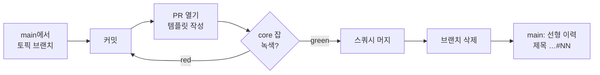

# 브랜치 작업 전략

이 repo의 브랜치·커밋·PR·머지·릴리스 흐름을 정리한 문서다. 에이전트용 규칙
요약은 [`CLAUDE.md`](../CLAUDE.md), 사람용 개요는 [`README.md`](../README.md)에
있고, **이 문서는 그중 "어떻게 브랜치를 따고 무엇을 지켜 머지하는가"의 상세**를
담당한다. 판정 상수·엔진 불변식 같은 내용의 단일 원천은 여전히 코드/데이터
파일이며(§[금지 사항](#금지-사항-요약)), 여기서는 중복하지 않고 링크한다.

## 한눈에 보기



- 브랜치 모델: **트렁크 기반**. 장수 브랜치는 `main` 하나뿐이고, 나머지는 전부
  단명(short-lived) 토픽 브랜치다.
- 머지: **스쿼시 전용**. `main` 이력은 PR 1건 = 커밋 1개로 선형 유지된다.
- 게이트: PR은 CI **`core` 잡**이 녹색이어야 머지된다(브랜치 룰셋 required check).

## 브랜치 모델

- `main` — 항상 배포 가능(green) 상태를 유지하는 유일한 통합 브랜치. 직접
  푸시하지 않고 반드시 PR로만 들어간다.
- 토픽 브랜치 — 하나의 태스크/PR 단위로 `main`에서 따고, 스쿼시 머지 후 삭제한다.
  릴리스 브랜치·개발 브랜치(develop) 같은 장수 분기는 두지 않는다.
- 기준선은 항상 최신 `main`이다. 작업 전 `git fetch origin main` 후 그 위에서
  분기한다. 오래된 브랜치는 머지 전에 `main`으로 rebase(또는 update)한다.

## 브랜치 이름 규칙

`<타입>/<주제-슬러그>` 형식을 쓴다. `<타입>`은 커밋 프리픽스와 같은 어휘를
공유한다(§[커밋 메시지](#커밋-메시지)). 이슈/태스크에 대응하면 슬러그에 코드를
녹인다.

| 예시 | 용도 |
| --- | --- |
| `feat/T-P3-2-fixture-suite` | 태스크 코드가 있는 기능 작업 |
| `fix/vendor-sync-path` | 버그 수정 |
| `docs/branching-strategy` | 문서 |
| `ci/release-tag-workflow` | CI·워크플로 |

- **에이전트(Claude Code) 세션 브랜치는 `claude/<슬러그>` 접두사**로 자동
  생성된다(예: `claude/branch-strategy-docs-qg1xpz`). 이 접두사는 사람 브랜치와
  구분하기 위한 관례이니 사람 작업에는 쓰지 않는다.
- 슬러그는 소문자·하이픈. `main`·릴리스 태그 이름(`v*`)과 겹치지 않게 한다.

## 커밋 메시지

Conventional Commits 스타일 프리픽스 + (있으면) 태스크 코드를 제목에 쓴다.

```
<타입>: <요약>            예) feat: okf init — §9 컨포먼트 최소 번들 스캐폴드
<타입>(T-P<페이즈>-<n>):  예) T-P3-2: 픽스처 스위트 — validate JSON 스냅샷 비교 CI 편입
```

- 자주 쓰는 타입: `feat` · `fix` · `docs` · `ci` · `quality` · `refactor` · `test`.
- 태스크 코드 `T-P<페이즈>-<번호>`(예: `T-P3-2`)는 이슈의 작업 단위를 가리키고,
  부록 `F-N` 코드는 외부 정본(스펙/설계) 기준을 가리킨다. PR 본문에서 대응
  관계를 명시한다.
- 제목은 한국어, 명령/완료형 요약. 본문은 필요 시 "무엇을 왜"를 덧붙인다.
- 커밋에 모델 식별자·내부 조직/저장소 실명 등 공개 repo에 남으면 안 되는 정보를
  넣지 않는다(§[금지 사항](#금지-사항-요약)의 참조 방향 정책).

## PR 규칙

1. 브랜치를 푸시하고 PR을 연다. 본문은
   [`.github/pull_request_template.md`](../.github/pull_request_template.md)
   구조(요약 / 관련 이슈 / 검증 / 체크리스트)를 그대로 채운다.
2. **검증** 항목은 이슈 완료 기준 체크박스별로 실행한 명령과 결과를 적는다.
3. **체크리스트**의 공개 repo 불변식·벤더 미수정·CI 녹색 항목을 실제로 만족시킨다.
4. CI `core` 잡이 녹색이 되어야 머지 버튼이 열린다(아래 §CI 게이트).

작은 자기 완결 PR을 선호한다. 하나의 PR은 하나의 태스크 코드에 대응하는 것을
기본으로 한다. Epic이 여러 유닛으로 쪼개지는 경우의 PR 분리·브랜치 제약 처리는
§Epic·유닛 분해 참조.

## 머지 전략 — 스쿼시 전용

- 모든 PR은 **스쿼시 머지**한다. `main`은 PR 1건당 커밋 1개인 선형 이력을
  유지한다(현재 이력의 모든 커밋이 부모 1개, merge 커밋 0개 — 이 규약의 실증).
- 스쿼시 커밋 제목이 `main`에 영구히 남으므로, 제목은 커밋 규칙(프리픽스 +
  태스크 코드)을 따르고 GitHub이 붙이는 `(#PR번호)` 접미사를 유지한다.
  예: `feat: okf init — §9 컨포먼트 최소 번들 스캐폴드 (#66)`.
- 머지 후 토픽 브랜치는 삭제한다. rebase 머지·merge 커밋은 쓰지 않는다.

## Epic·유닛 분해 — 유닛당 PR

큰 작업은 **Epic**(구현 트래커 이슈)으로 열고, 실제 작업은 그 아래
**유닛(sub-issue, 예: `S1`~`S5`)** 으로 분해한다. 이때 **PR 단위는 Epic이 아니라
유닛이다** — 유닛당 브랜치 → 유닛당 PR이 기본이다.

- Epic은 트래커일 뿐 그 자체로 머지되지 않는다. 각 유닛 PR이 자기 sub-issue를
  닫는다(`Closes #NN`).
- **여러 유닛을 한 PR·브랜치에 쌓지 않는다.** 스쿼시 머지는 PR 1건을 커밋 1건으로
  합치므로(§머지 전략), 한 PR에 여러 유닛을 넣으면 그 경계가 `main` 이력에서
  사라진다 → 유닛 단위 리뷰·되돌리기·bisect·이슈 매핑이 모두 불가능해진다.
- **커밋을 유닛별로 나누는 것으로는 부족하다.** 스쿼시가 커밋을 뭉개므로 경계는
  커밋이 아니라 PR에 있어야 한다.

의존 순서를 지킨다:

- 선행이 필요한 유닛(예: `S4`→`S3` 의존)은 선행 PR이 머지된 뒤 최신 `main`에서
  후속 유닛 브랜치를 딴다.
- 서로 독립인 유닛(예: `S2`·`S3`)은 각각 `main`에서 따 병렬로 PR을 연다.

예외는 정말로 쪼갤 수 없는 원자적 변경뿐이며, 그때도 왜 묶었는지 PR 본문에
명시한다.

### 단일 브랜치 제약과 충돌하면 — 먼저 묻는다

자동화·에이전트(Claude Code) 세션은 "지정된 브랜치 하나에서만 개발하고 허가
없이 다른 브랜치로 푸시 금지" 같은 **브랜치 스코프 제약**을 받을 수 있다. 이
제약은 유닛당 브랜치(= 유닛당 PR)와 정면으로 충돌한다.

**충돌이 보이면 유닛을 한 브랜치에 임의로 묶지 말고, 유닛별 브랜치 분리 허가를
먼저 요청한다.** 제약과 관례가 부딪힐 때 한쪽을 말없이 희생하는 것이 실수다 —
드러내어 확인한다.

- 허가를 받으면 유닛별 브랜치 → 유닛별 PR로 진행한다.
- 허가를 못 받아 단일 브랜치·단일 PR로 갈 수밖에 없으면, PR 본문에 "여러 유닛
  묶음 + 사유"를 명시하고 최소한 유닛 경계를 커밋으로 보존한다(차선책이지
  기본이 아니다).

> 배경: Epic #72(study)는 유닛 `S1`~`S5`를 유닛별 PR로 계획했으나, 세션이 단일
> 지정 브랜치로 제약돼 5유닛이 PR #78 하나로 묶여 머지됐다. 필요했던 행동은
> "유닛별 PR을 하려면 브랜치 분리 허가가 필요하다"고 먼저 알리는 것이었다. 이
> 절은 그 재발을 막기 위한 규칙이다.

## CI 게이트 — `core` 잡

- CI는 [`.github/workflows/ci.yml`](../.github/workflows/ci.yml)의 단일 잡
  **`core`** 로 돈다(`on: [push, pull_request]`). 스텝 순서:
  자기 번들(.okf) 검증 → JSON 스텁 파싱 → 린트·포맷(ruff 0.15.8 핀) → 빌드 →
  테스트 → 픽스처 스위트 → 오라클 차동(리포트) → 벤더 동기화 → 라이선스 →
  플러그인 검증.
- 잡 이름 **`core` 는 절대 바꾸지 않는다.** `main` 브랜치 룰셋의 required
  status check 컨텍스트가 이 이름이라, 바꾸면 게이트가 통째로 풀린다.
- 검사를 **추가**할 때는 새 잡을 만들지 말고 `core` 잡에 스텝으로 확장한다.
  required check 컨텍스트를 하나로 유지하기 위해서다.

### 파괴 감지 검사는 red를 실증한다

스냅샷·해시·게이트처럼 "무언가 깨지면 CI가 막아야 하는" 성격의 검사(픽스처
스냅샷, 벤더 동기화 해시, 라이선스/grep 게이트 등)를 **추가하거나 바꿀 때**는,
고의 실패 커밋으로 실제 red가 나는지 실증하고 원복해 그 사실을 PR에 기록한다.
"검사가 정말 막는다"를 증명하는 이 repo의 관례다.

## 릴리스 — 태그

> 배포·버전 선정 전략(마일스톤·SemVer·`.devN`·컷 절차·체크리스트)은
> [`releasing.md`](releasing.md)가 정본이다. 이 절은 **태그 메커니즘 요약**만 담는다.

- 릴리스 태그는 `vX.Y.Z` 형식이고 **불변**이다. `protect-release-tags` 룰셋이
  태그 삭제·이동(재지정)을 차단한다(거부 코드 GH013이 정상).
- 태그는 로컬에서 푸시하지 않고 **Actions 내부에서만 생성**한다
  ([`release-tag.yml`](../.github/workflows/release-tag.yml),
  `workflow_dispatch` → `mode=create`). 원격 세션의 git 프록시가 `refs/tags`
  푸시를 차단하기 때문이다.
- 이미 있는 태그를 다시 만들려 하면 워크플로가 중단한다(불변 태그 원칙).
  `mode=verify-protection`은 삭제·이동이 실제로 거부되는지 파괴 실증한다.
- 소비 repo는 태그를 핀으로 잡는다:
  `uses: pmmm114/okf-wiki-plugin/actions/validate@<v태그>`,
  pre-commit `rev: <v태그>`.

## 벤더·업스트림 반영

- `okf-core/vendor/`는 업스트림 바이트 그대로다. 직접 수정하지 않고, 필요한
  변경은 `vendor/patches/` 패치 + `vendor.lock` 갱신으로 반영한다
  (CI의 vendor 동기화 검사가 직접 수정을 차단).
- [`upstream-watch.yml`](../.github/workflows/upstream-watch.yml)이 주 1회
  `vendor.lock` 핀과 업스트림 최신을 비교해 **변경 시 이슈만 생성**한다.
  자동 반영은 하지 않는다 — 검토 후 수동 반입 여부를 사람이 결정한다.

## 금지 사항 요약

브랜치 작업 중 특히 주의할 "어겨서는 안 되는 것"들. 전체·정본은
[`CLAUDE.md`](../CLAUDE.md)에 있으니 그쪽을 단일 원천으로 삼는다.

- CI 잡 이름 **`core` 변경 금지**(required check 컨텍스트).
- `okf-core/vendor/` **1바이트도 수정 금지** — 필요 시 `vendor/patches/`로.
- 판정 상수(예약 파일명·필수/권장 필드·strict 승격 집합)를 코드에 하드코딩
  금지 — `okf-core/src/okf_core/rules/v0_1.json`이 단일 원천.
- 파스는 `parser.parse` 한 곳에서 파일당 1회(호출 카운터 테스트가 차단).
- "index 소비 파일 집합 == validate §9 통과 집합" 불변식 유지.
- `plugins/okf/.claude-plugin/plugin.json`에 **version 필드 금지**(SHA 추적).
- 엔진(`okf-core/src/`)은 Claude를 모른다 — `CLAUDE_`·claude 참조 금지.
- 공개 repo 불변식: 소비 조직·저장소 실명 및 내부 정보를 diff·PR 본문·커밋
  메시지에 남기지 않는다(참조 방향 정책).

## 자주 쓰는 명령

```bash
# 최신 main에서 토픽 브랜치 따기
git fetch origin main
git switch -c feat/T-P3-2-fixture-suite origin/main

# 로컬에서 CI와 같은 검사 돌려보기
uv run --with pytest --with pyyaml python -m pytest okf-core/tests -q   # 테스트
uvx ruff check . && uvx ruff format --check .                          # 린트·포맷
uv run --project okf-core okf validate .okf --strict                   # 자기 번들 검증
uv run --with pyyaml python okf-core/scripts/run_fixture_suite.py       # 픽스처 스위트

# 픽스처 스냅샷 갱신(회귀 계약) — diff 검수 후 커밋
uv run --with pyyaml python okf-core/scripts/run_fixture_suite.py --update

# 푸시 후 PR을 열고, core 잡 녹색 확인 → 스쿼시 머지 → 브랜치 삭제
git push -u origin feat/T-P3-2-fixture-suite
```
