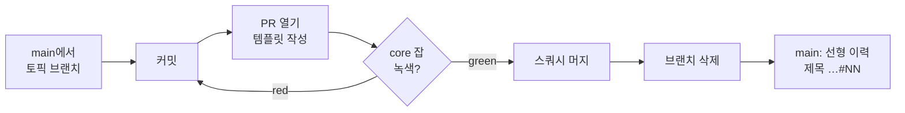

# 브랜치 작업 전략

이 문서는 이 repo에 기여할 때 **브랜치를 어떻게 따고 무엇을 지켜 머지하는지**를
정리한 규칙서입니다. 브랜치 모델과 이름 규칙에서 시작해 커밋 메시지, PR, 스쿼시
머지, CI 게이트, 릴리스 태그, 벤더 반영까지 이어집니다. 에이전트가 지켜야 할 작업
규칙과 어겨서는 안 되는 불변식의 정본은 [CLAUDE.md](../CLAUDE.md)에, 사람이 읽는
프로젝트 개요는 [README](../README.md)에 따로 있습니다. 판정 상수나 엔진 불변식처럼
값 자체가 정본인 것들은 여전히 코드와 데이터 파일이 단일 원천이므로, 여기서는 같은
내용을 다시 적지 않고 [금지 사항 요약](#금지-사항-요약)에서 링크만 겁니다.

## 목차

- [한눈에 보기](#한눈에-보기)
- [브랜치 모델](#브랜치-모델)
- [브랜치 이름 규칙](#브랜치-이름-규칙)
- [커밋 메시지](#커밋-메시지)
- [PR 규칙](#pr-규칙)
- [머지 전략](#머지-전략)
- [Epic과 유닛 분해](#epic과-유닛-분해)
- [CI 게이트](#ci-게이트)
- [릴리스 태그](#릴리스-태그)
- [벤더와 업스트림 반영](#벤더와-업스트림-반영)
- [금지 사항 요약](#금지-사항-요약)
- [자주 쓰는 명령](#자주-쓰는-명령)
- [관련 문서](#관련-문서)

## 한눈에 보기


```mermaid
flowchart LR
  A[main에서<br/>토픽 브랜치] --> B[커밋]
  B --> C[PR 열기<br/>템플릿 작성]
  C --> D{core 잡<br/>녹색?}
  D -- red --> B
  D -- green --> E[스쿼시 머지]
  E --> F[브랜치 삭제]
  F --> G[main: 선형 이력<br/>제목 …#NN]
```

- **브랜치 모델은 트렁크 기반**(장수 브랜치 없이 하나의 통합 브랜치만 두는 방식)
  입니다. 오래 사는 브랜치는 `main` 하나뿐이고 나머지는 전부 짧게 쓰고 지우는
  토픽 브랜치입니다.
- 머지는 스쿼시만 씁니다. 그래서 `main` 이력은 PR 1건이 커밋 1개가 되는 선형
  이력으로 유지됩니다.
- 게이트는 CI `core` 잡입니다. 이 잡이 녹색이어야 PR을 머지할 수 있고, 이는
  브랜치 룰셋의 required check로 강제됩니다.

## 브랜치 모델

- `main`은 항상 배포 가능한(green) 상태를 유지하는 유일한 통합 브랜치입니다.
  여기에는 직접 푸시하지 않고 반드시 PR을 거쳐서만 들어갑니다.
- 토픽 브랜치는 하나의 태스크, 곧 하나의 PR 단위로 `main`에서 따고, 스쿼시 머지가
  끝나면 삭제합니다. 릴리스 브랜치나 개발 브랜치(`develop`)처럼 오래 사는 분기는
  두지 않습니다.
- 기준선은 언제나 최신 `main`입니다. 작업을 시작하기 전에 `git fetch origin main`을
  실행하고 그 위에서 분기합니다. 오래된 브랜치는 머지하기 전에 `main`으로
  rebase하거나 update해서 기준선을 다시 맞춥니다.

## 브랜치 이름 규칙

브랜치 이름은 `<타입>/<주제-슬러그>` 형식을 씁니다. `<타입>`은
[커밋 메시지](#커밋-메시지)의 프리픽스와 같은 어휘를 공유합니다. 이슈나 태스크에
대응하는 작업이라면 그 코드를 슬러그 안에 녹여 넣습니다.

| 예시 | 용도 |
| --- | --- |
| `feat/t-p3-2-fixture-suite` | 태스크 코드가 있는 기능 작업 |
| `fix/vendor-sync-path` | 버그 수정 |
| `docs/branching-strategy` | 문서 |
| `ci/release-tag-workflow` | CI·워크플로 |

- 에이전트(Claude Code) 세션이 만드는 브랜치는 `claude/<슬러그>` 접두사로 자동
  생성됩니다(예: `claude/branch-strategy-docs-qg1xpz`). 이 접두사는 사람이 만든
  브랜치와 구분하기 위한 관례이므로 사람 작업에는 쓰지 않습니다.
- 슬러그는 소문자와 숫자, 하이픈만 씁니다. 태스크 코드를 녹여 넣을 때도 소문자로
  적습니다(`T-P3-2` → `t-p3-2`). `main`이나 릴리스 태그 이름(`v*`)과 겹치지 않게
  짓습니다.

이 규칙은 [정책 게이트](#브랜치pr-정책-게이트)가 PR마다 검사합니다.

## 커밋 메시지

커밋 제목에는 Conventional Commits 스타일 프리픽스를 붙이고, 대응하는 태스크
코드가 있으면 함께 적습니다.

```
<타입>: <요약>            예) feat: okf init — §9 컨포먼트 최소 번들 스캐폴드
<타입>(T-P<페이즈>-<n>):  예) T-P3-2: 픽스처 스위트 — validate JSON 스냅샷 비교 CI 편입
```

- 쓸 수 있는 타입은 `feat`, `fix`, `docs`, `ci`, `quality`, `refactor`, `test`,
  `chore`, `release`, `build`, `style` 열한 가지입니다. 이 어휘는 취향 문제가
  아닙니다. `scripts/next_version.py`가 커밋 타입에서 릴리스 번호를 도출하므로,
  어휘 밖의 오타(`fet:`)는 막히지 않으면 "범프 신호 없음"으로 조용히 새어 나가
  릴리스 판정을 바꿉니다. 어휘를 늘리려면 `scripts/release_notes.py`의 분류표를
  고치면 게이트가 따라옵니다.
- 태스크 코드 `T-P<페이즈>-<번호>`(예: `T-P3-2`)는 이슈 안의 작업 단위를 가리키고,
  부록 `F-N` 코드는 외부 정본, 곧 스펙이나 설계 문서의 기준을 가리킵니다. 둘이
  어떻게 대응하는지는 PR 본문에 명시합니다.
- 제목은 한국어로 쓰고, 명령형이나 완료형 요약으로 맺습니다. 본문은 필요할 때만
  붙이되 "무엇을 왜 했는지"를 적습니다.
- 모델 식별자(`Claude Opus 4.8` 같은 이름+버전 표기)나 에이전트 **세션 공유 링크**
  (`Claude-Session: https://claude.ai/code/session_...`), 내부 조직·저장소의 실명처럼
  공개 repo에 남으면 안 되는 정보는 커밋에 넣지 않습니다. 공동 작성자를 남길 때는
  버전 없는 `Co-authored-by: Claude <noreply@anthropic.com>`를 씁니다. 자세한 내용은
  [금지 사항 요약](#금지-사항-요약)의 참조 방향 정책에 있습니다.
- 제목에 `(#NN)`을 직접 붙이지 않습니다. 스쿼시할 때 GitHub이 PR 번호를 자동으로
  붙이므로, 미리 넣으면 `(#153) (#170)`처럼 두 번 붙습니다.

커밋 제목과 메시지는 [정책 게이트](#브랜치pr-정책-게이트)가 검사합니다. 스쿼시가
커밋 본문을 `main`에 합쳐 넣기 때문에, 제목뿐 아니라 **본문에 남긴 트레일러까지**
검사 대상입니다.

## PR 규칙

1. 브랜치를 푸시하고 PR을 엽니다. 본문은
   [.github/pull_request_template.md](../.github/pull_request_template.md)의
   구조(요약, 관련 이슈, 검증, 체크리스트)를 그대로 채웁니다.
2. **검증** 항목에는 이슈의 완료 기준 체크박스별로 실제로 실행한 명령과 그 결과를
   적습니다.
3. **체크리스트**의 공개 repo 불변식, 벤더 미수정, CI 녹색 항목은 문구만 체크하지
   말고 실제로 만족시킵니다.
4. CI `core` 잡이 녹색이 되어야 머지 버튼이 열립니다. 자세한 내용은
   [CI 게이트](#ci-게이트)에 있습니다.

작고 그 자체로 완결된 PR을 선호합니다. 하나의 PR은 하나의 태스크 코드에 대응하는
것을 기본으로 합니다. Epic이 여러 유닛으로 쪼개질 때 PR을 어떻게 나누고 브랜치
제약을 어떻게 처리하는지는 [Epic과 유닛 분해](#epic과-유닛-분해)에서 다룹니다.

## 머지 전략

- 모든 PR은 **스쿼시 머지**합니다. 그래서 `main`은 PR 1건당 커밋 1개인 선형 이력을
  유지합니다. 지금 이력의 모든 커밋이 부모를 하나만 가지고 merge 커밋이 0개라는
  점이 이 규약이 실제로 지켜지고 있다는 증거입니다.
- 스쿼시 커밋의 제목은 `main`에 영구히 남습니다. 그래서 제목은 커밋 규칙(프리픽스와
  태스크 코드)을 따르고, GitHub이 자동으로 붙이는 `(#PR번호)` 접미사는 그대로
  둡니다.
  예를 들면 `feat: okf init — §9 컨포먼트 최소 번들 스캐폴드 (#66)`처럼 됩니다.
- 머지가 끝나면 토픽 브랜치는 삭제합니다. rebase 머지나 merge 커밋은 쓰지 않습니다.

## Epic과 유닛 분해

큰 작업은 **Epic**(구현 트래커 이슈)으로 열고, 실제 작업은 그 아래
**유닛**(sub-issue, 예: `S1`부터 `S5`까지)으로 분해합니다. 이때 PR을 나누는 단위는
Epic이 아니라 유닛입니다. 유닛마다 브랜치를 따고 유닛마다 PR을 여는 것이
기본입니다.

- Epic은 트래커일 뿐이고 그 자체로 머지되지 않습니다. 각 유닛 PR이 자기
  sub-issue를 닫습니다(`Closes #NN`).
- **여러 유닛을 한 PR이나 한 브랜치에 쌓지 않습니다.** [머지 전략](#머지-전략)에서
  설명했듯 스쿼시 머지는 PR 1건을 커밋 1건으로 합치므로, 한 PR에 여러 유닛을
  넣으면 유닛 경계가 `main` 이력에서 사라집니다. 그러면 유닛 단위로 리뷰하거나
  되돌리거나 bisect로 원인을 찾거나 이슈에 매핑하는 일이 모두 불가능해집니다.
- **커밋을 유닛별로 나누는 것만으로는 부족합니다.** 스쿼시가 커밋을 하나로 뭉개기
  때문에, 경계는 커밋이 아니라 PR에 있어야 합니다.

유닛 사이의 의존 순서도 지킵니다.

- 선행 작업이 필요한 유닛(예: `S4`가 `S3`에 의존하는 경우)은 선행 PR이 머지된 뒤에
  최신 `main`에서 후속 유닛 브랜치를 땁니다.
- 서로 독립인 유닛(예: `S2`와 `S3`)은 각각 `main`에서 따서 병렬로 PR을 엽니다.

예외는 정말로 쪼갤 수 없는 원자적 변경뿐입니다. 그런 경우에도 왜 묶었는지를 PR
본문에 명시합니다.

### 단일 브랜치 제약과 충돌할 때

자동화나 에이전트(Claude Code) 세션은 "지정된 브랜치 하나에서만 개발하고 허가
없이 다른 브랜치로 푸시하지 말 것" 같은 **브랜치 스코프 제약**을 받을 수 있습니다.
이 제약은 유닛마다 브랜치를 따고 유닛마다 PR을 여는 방식과 정면으로 충돌합니다.

충돌이 보이면 유닛을 한 브랜치에 임의로 묶지 말고, 유닛별로 브랜치를 나눠도 되는지
허가를 먼저 요청합니다. 제약과 관례가 부딪힐 때 한쪽을 말없이 희생하는 것이
실수입니다. 드러내서 확인해야 합니다.

- 허가를 받으면 유닛별 브랜치와 유닛별 PR로 진행합니다.
- 허가를 받지 못해 단일 브랜치, 단일 PR로 갈 수밖에 없다면 PR 본문에 "여러 유닛을
  묶었다는 사실과 그 사유"를 명시하고, 최소한 유닛 경계만이라도 커밋으로
  보존합니다. 이것은 어디까지나 차선책이고 기본 방식이 아닙니다.

> **배경.** Epic #72(study)는 유닛 `S1`부터 `S5`까지를 유닛별 PR로 계획했습니다.
> 그러나 세션이 단일 지정 브랜치로 제약돼 5개 유닛이 PR #78 하나로 묶여
> 머지됐습니다. 필요했던 행동은 "유닛별 PR을 하려면 브랜치 분리 허가가 필요하다"고
> 먼저 알리는 것이었습니다. 이 절은 그 일이 되풀이되지 않게 하려고 둔 규칙입니다.

## CI 게이트

- CI는 [.github/workflows/ci.yml](../.github/workflows/ci.yml)에 정의된 단일 잡
  **`core`** 로 돕니다(`on: [push, pull_request]`). 스텝은 다음 순서로 실행됩니다.

  1. 브랜치·PR 정책 게이트(PR 이벤트에서만)
  2. 자기 번들(`.okf`) 검증
  3. JSON 스텁 파싱
  4. 린트·포맷(ruff 0.15.8 핀)
  5. 빌드
  6. 테스트
  7. 픽스처 스위트
  8. 오라클 차동(리포트)
  9. 벤더 동기화
  10. 라이선스
  11. 플러그인 검증

- 잡 이름 **`core`는 절대 바꾸지 않습니다.** `main` 브랜치 룰셋의 required status
  check 컨텍스트가 바로 이 이름이라, 이름을 바꾸면 게이트가 통째로 풀립니다.
- 검사를 추가할 때는 새 잡을 만들지 말고 `core` 잡에 스텝으로 붙입니다. required
  check 컨텍스트를 하나로 유지하기 위해서입니다.

### 브랜치·PR 정책 게이트

이 문서의 규약 가운데 기계로 판정할 수 있는 것은
[`scripts/branch_policy.py`](../scripts/branch_policy.py)가 PR마다 검사합니다.
검사 대상은 **스쿼시할 때 `main`에 새겨지는 것 전부**입니다. repo 설정이 스쿼시
제목을 PR 제목에서, 본문을 브랜치 커밋 메시지에서 가져오기 때문입니다.

| 검사 | 막는 것 |
| --- | --- |
| 브랜치 이름 | `<타입>/<슬러그>` 형식과 어휘, 소문자 슬러그 |
| PR 제목 | 타입 프리픽스, 어휘 밖 오타, 앞뒤 공백, `(#NN)` 중복 |
| PR 본문 | PR 템플릿의 섹션 누락 |
| PR 제목·본문·커밋 메시지 | 모델 식별자, 세션 공유 링크 |

판정 상수를 새로 만들지 않습니다. 타입 어휘는 `scripts/release_notes.py`의
분류표에서 파생하고, PR 본문의 필수 섹션은
[PR 템플릿](../.github/pull_request_template.md)의 헤딩을 그대로 읽습니다. 어느
쪽이든 원본을 고치면 게이트가 따라옵니다.

게이트를 로컬에서 미리 돌려 볼 수 있습니다.

```bash
python3 scripts/branch_policy.py --branch "$(git branch --show-current)"
python3 scripts/branch_policy.py --subject "docs: 제목 예시"
```

### 파괴 감지 검사

픽스처 스냅샷이나 벤더 동기화 해시, 라이선스와 grep 게이트처럼 "무언가 깨지면 CI가
막아야 한다"는 성격의 검사가 있습니다. 이런 검사를 **추가하거나 바꿀 때**는 일부러
실패하는 커밋으로 실제로 CI가 막는지 확인하고, 확인한 뒤 원복해서 그 사실을 PR에
기록합니다. "이 검사가 정말로 막아 준다"를 증명하는 이 repo의 관례입니다.

## 릴리스 태그

> **먼저 볼 것.** 배포와 버전 선정 전략, 곧 스코프 마일스톤과 커밋에서 도출하는
> SemVer, 릴리스 컷 절차, 체크리스트는 [배포·버전관리 전략](releasing.md)이 정본입니다.
> 이 절은 태그 메커니즘 요약만 담습니다.

- 릴리스 태그는 `vX.Y.Z` 형식이고 한 번 붙으면 바뀌지 않습니다.
  `protect-release-tags` 룰셋이 태그 삭제와 이동(재지정)을 차단합니다. 거부 코드로
  GH013이 나오면 정상입니다.
- 태그는 로컬에서 푸시하지 않고 Actions 안에서만 만듭니다
  ([release-tag.yml](../.github/workflows/release-tag.yml)을 `workflow_dispatch`로
  실행하면서 `mode=create`를 줍니다). 원격 세션의 git 프록시가 `refs/tags` 푸시를
  차단하기 때문입니다.
- 이미 있는 태그를 다시 만들려고 하면 워크플로가 중단합니다. 태그는 바뀌지 않는다는
  원칙 때문입니다. `mode=verify-protection`은 삭제와 이동이 실제로 거부되는지를
  일부러 시도해서 확인합니다.
- 가져다 쓰는 repo는 태그로 버전을 고정합니다. GitHub Actions에서는
  `uses: pmmm114/okf-wiki-plugin/actions/validate@<v태그>`로, pre-commit에서는
  `rev: <v태그>`로 적습니다.

## 벤더와 업스트림 반영

- `okf-core/vendor/`는 업스트림 바이트 그대로입니다. 직접 수정하지 않고, 필요한
  변경은 `vendor/patches/`에 패치를 두고 `vendor.lock`을 갱신하는 방식으로
  반영합니다. CI의 vendor 동기화 검사가 직접 수정을 차단합니다.
- [upstream-watch.yml](../.github/workflows/upstream-watch.yml)이 주 1회
  `vendor.lock`에 고정된 버전과 업스트림 최신을 비교해서, 달라졌으면 이슈만
  만듭니다. 자동으로 반영하지는 않습니다. 검토한 뒤 수동으로 들여올지 말지는
  사람이 결정합니다.

## 금지 사항 요약

브랜치 작업 중에 특히 주의해야 할 "어겨서는 안 되는 것"들입니다. 전체 목록과
정본은 [CLAUDE.md](../CLAUDE.md)에 있으니 그쪽을 단일 원천으로 삼습니다.

- CI 잡 이름 `core`를 바꾸지 않습니다(required check 컨텍스트).
- `okf-core/vendor/`는 1바이트도 수정하지 않습니다. 필요하면 `vendor/patches/`로
  반영합니다.
- 판정 상수(예약 파일명, 필수 필드와 권장 필드, strict 승격 집합)를 코드에
  하드코딩하지 않습니다. `okf-core/src/okf_core/rules/v0_1.json`이 단일 원천입니다.
- 파스는 `parser.parse` 한 곳에서 파일당 한 번만 합니다(호출 카운터 테스트가
  차단합니다).
- index가 읽는 파일 집합과 validate §9를 통과한 파일 집합이 항상 같아야 한다는
  불변식을 유지합니다.
- `plugins/okf/.claude-plugin/plugin.json`에는 version 필드를 넣지 않습니다(커밋
  SHA로 추적합니다).
- 엔진(`okf-core/src/`)은 Claude를 모릅니다. `CLAUDE_`나 claude 참조를 넣지
  않습니다.
- 공개 repo 불변식을 지킵니다. 소비 조직이나 저장소의 실명, 내부 정보, 모델
  식별자, 에이전트 세션 공유 링크를 diff와 PR 본문, 커밋 메시지에 남기지
  않습니다(참조 방향 정책). 뒤의 두 가지는
  [정책 게이트](#브랜치pr-정책-게이트)가 차단합니다.

## 자주 쓰는 명령

```bash
# 최신 main에서 토픽 브랜치 따기
git fetch origin main
git switch -c feat/T-P3-2-fixture-suite origin/main

# 로컬에서 CI와 같은 검사 돌려보기
uv run --with pytest --with pyyaml python -m pytest okf-core/tests -q   # 테스트
uvx ruff check . && uvx ruff format --check .                          # 린트·포맷
uv run --project okf-core okf validate .okf --strict                   # 자기 번들 검증
uv run --with pyyaml python okf-core/scripts/run_fixture_suite.py       # 픽스처 스위트

# 픽스처 스냅샷 갱신(회귀 계약) — diff 검수 후 커밋
uv run --with pyyaml python okf-core/scripts/run_fixture_suite.py --update

# 푸시 후 PR을 열고, core 잡 녹색 확인 → 스쿼시 머지 → 브랜치 삭제
git push -u origin feat/T-P3-2-fixture-suite
```

## 관련 문서

| 문서 | 무슨 내용인지 |
| --- | --- |
| [배포·버전관리 전략](releasing.md) | 배포와 버전 관리 — 스코프 마일스톤, 커밋에서 도출하는 SemVer, 릴리스 컷 절차 |
| [CONTRIBUTING.md](../CONTRIBUTING.md) | 컨포먼스와 회귀 계약, 엔진 CLI, 로컬에서 재현하기 |
| [CLAUDE.md](../CLAUDE.md) | 에이전트가 지켜야 할 작업 규칙과 어겨서는 안 되는 불변식의 정본 |
| [PR 템플릿](../.github/pull_request_template.md) | PR 본문에 채워야 할 네 섹션 |
| [ci.yml](../.github/workflows/ci.yml) | `core` 잡의 실제 스텝 정의 |
| [README](../README.md) | 프로젝트 전체 개요와 시작 가이드 |
