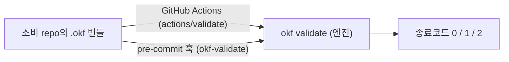

# 소비 repo에서 번들 검증하기

OKF 번들을 가져다 쓰는 repo에서 CI와 커밋 단계에 번들 검증을 거는 방법입니다. 엔진과 똑같은 [컨포먼스 검사](../okf-core/vendor/spec/SPEC.md#9-conformance)를 배포면에 걸어 두면, 형식이 어긋난 번들이 조용히 병합되는 것을 막을 수 있습니다. 배포면은 GitHub Actions용 composite action과 pre-commit 훅 정의 두 가지이고, 둘 다 이 repo가 그대로 제공합니다.

## 한눈에 보기



- 두 방식은 입구만 다르고, 실제 판정은 **같은 엔진의 `okf validate`** 한 곳에서 납니다.
- 어느 쪽이든 이 repo를 특정 버전에 고정해서 씁니다. GitHub Actions는 `@<v태그>`로, pre-commit은 `rev: <v태그>`로 고정합니다.

## GitHub Actions

이 repo가 제공하는 composite action(`actions/validate`)을 그대로 가져다 씁니다. 검사할 번들이 워크스페이스에 있어야 하므로 checkout을 먼저 둡니다.

```yaml
steps:
  - uses: actions/checkout@<SHA>
  - uses: pmmm114/okf-wiki-plugin/actions/validate@<v태그>
    with: { path: .okf, strict: true }
```

받는 입력은 두 개입니다.

| 입력 | 하는 일 | 기본값 |
| --- | --- | --- |
| `path` | 검증할 번들 경로를 정합니다 | `.okf` |
| `strict` | 스펙이 거부까지는 요구하지 않는 warn(깨진 링크와 권장 필드 부재)을 error로 승격합니다 | `"true"` |

둘 다 생략할 수 있고, 생략하면 위 기본값이 그대로 쓰입니다. `strict` 값이 문자열 `true`와 같으면 `okf validate <path> --strict`를 실행하고, 그렇지 않으면 `--strict` 없이 `okf validate <path>`를 실행합니다.

엔진 버전을 고르는 input은 일부러 두지 않았습니다. action은 검사 직전에 자기 사본에 동봉된 엔진(`okf-core`)을 `pip install`로 설치해서 부르기 때문에, 어떤 엔진으로 검증할지는 소비처가 적어 둔 `@<v태그>`가 결정합니다.

## pre-commit

커밋할 때마다 로컬에서 같은 검사를 돌리려면 pre-commit 훅을 겁니다.

```yaml
# .pre-commit-config.yaml
repos:
  - repo: https://github.com/pmmm114/okf-wiki-plugin
    rev: <v태그>
    hooks:
      - id: okf-validate
```

훅 정의는 이 repo의 `.pre-commit-hooks.yaml`에 들어 있고, 소비처가 채워 넣을 입력은 따로 없습니다. 정의된 값은 다음과 같습니다.

| 필드 | 값 | 하는 일 |
| --- | --- | --- |
| `id` | `okf-validate` | 소비처 설정에서 이 훅을 가리키는 이름입니다 |
| `entry` | `okf validate .okf --strict` | 실행할 명령이 이렇게 고정돼 있습니다 |
| `language` | `python` | 이 repo 루트를 pip으로 설치해 엔진을 준비합니다 |
| `files` | `\.md$` | 커밋에 markdown 파일이 들어 있을 때만 훅이 돕니다 |
| `pass_filenames` | `false` | 바뀐 파일 목록을 넘기지 않고 번들 전체를 검사합니다 |

`entry`가 고정이라 pre-commit 쪽은 언제나 `.okf`를 `--strict`로 검사합니다. 이 조합은 composite action의 기본값(`path`는 `.okf`, `strict`는 `true`)과 같으므로, action을 기본값 그대로 쓰면 두 입구의 검사 조건이 정확히 일치합니다.

## 같은 엔진, 같은 판정

두 방식 모두 속으로는 엔진의 `okf validate`를 부릅니다. 종료코드와 검사 규칙이 같으니, CI에서 통과한 번들은 pre-commit에서도 통과합니다.

| 종료코드 | 뜻 |
| --- | --- |
| `0` | 컨포먼트 |
| `1` | 비컨포먼트 |
| `2` | 실행 오류 |

엔진 CLI를 직접 부르는 방법과 종료코드는 [CONTRIBUTING.md](../CONTRIBUTING.md)에 정리되어 있습니다.

## 관련 문서

| 문서 | 무슨 내용인지 |
| --- | --- |
| [CONTRIBUTING.md](../CONTRIBUTING.md) | 컨포먼스와 회귀 계약, 엔진 CLI 호출면과 종료코드, 로컬에서 재현하기 |
| [배포·버전관리 전략](releasing.md) | 소비처가 고정하는 `<v태그>`가 어떻게 만들어지는지 |
| [OKF v0.1 스펙](../okf-core/vendor/spec/SPEC.md) | 컨포먼스 규칙 원문(고치지 않고 벤더로 가져온 스펙) |
| [README](../README.md) | okf-wiki-plugin의 전체 구성과 시작하기 |
