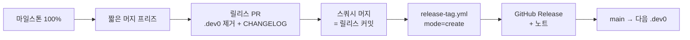

# 배포·버전관리 전략

이 repo의 **"다음 버전 선정 → 컷 → 태그 → 배포"** 전략 정본이다. 브랜치·PR·머지·
태그 **메커니즘**은 [`branching.md`](branching.md), 에이전트 규칙 요약은
[`../CLAUDE.md`](../CLAUDE.md)에 있다. 이 문서는 그 위에서 **무엇을 언제 릴리스로
묶고 버전을 어떻게 매기는가**를 담당한다.

> 이 전략은 의사결정 분석(대안 4종 · 가중 평가 · 민감도)으로 선정됐다. 요지:
> 트렁크 기반·선형 main·불변 SemVer 태그라는 기존 제약에 가장 적합하고, 뒤에
> 케이던스·릴리스 브랜치를 *되돌리지 않고 얹을 수 있는* 옵션 가치가 가장 크다.

## 결정 요약

| 축 | 채택 | 유예(트리거 시) |
| --- | --- | --- |
| 릴리스 모델 | **마일스톤 게이트 트렁크** — 마일스톤이 범위, 완성 커밋에 태그 | 릴리스 브랜치(다중 버전 유지 필요 시) |
| 버전 체계 | **SemVer + `.devN` 사이클**, 0.x 관례 | CalVer(부적합 — 계약 신호를 숨김) |
| 배포 | **repo 직배달(태그 핀) + GitHub Release** | PyPI publish(외부 Python 소비자 등장 시) |
| 케이던스 | 이벤트 구동(마일스톤 완성) + 목표일은 가이드 | 고정 트레인(소비자 출시일 요구 시) |

두 불변을 동시에 만족시키는 방식:

- **main은 집합소(G2)** — 항상 `X.Y.Z.dev0`로 굴러간다. 릴리스는 그 위의
  **라벨(태그)**일 뿐, "지금 main 전부"가 아니라 "마일스톤 완성 커밋의 스냅샷".
- **릴리스엔 정해진 항목만(G1)** — 범위는 **마일스톤 멤버십**으로 정의. 먼저
  랜딩해야 하는 미완성분은 **비활성 기본값**(예: `study.capture: off`)으로 재워
  릴리스 동작에 영향이 없게 한다 → 집합소이면서도 활성은 선별된다.

## 버전 체계 — SemVer

태그 `vX.Y.Z` 하나가 **repo 전체 묶음**(엔진 + 플러그인 + `actions/validate` +
pre-commit)의 직배달(D2) 릴리스다.

- **숫자 SoT**: `okf-core/pyproject.toml`의 `version`. ⚠️ 루트 `pyproject.toml`
  셔틀에도 같은 버전이 **하드코딩**돼 있으니 릴리스 시 **둘 다** 올린다(체크리스트).
- **플러그인**은 version 필드 없음(SHA 추적, `plugin.json` 불변식) → 플러그인의
  "버전"은 소비처가 핀하는 태그 그 자체다.
- **`.devN` 사이클**: 개발 중 main은 `0.2.0.dev0`(= 0.2.0 미출시 dev)을 단다.
  릴리스 때 `.dev0`를 떼어 `0.2.0` → 태그 `v0.2.0` → 직후 main을 다음
  `0.3.0.dev0`로 올린다. 그래서 main은 늘 "다음 버전 dev"인 집합소로 굴러간다.

### 무엇이 어느 자리를 올리나 (0.x 관례)

소비자 **계약 표면** = §9 컨포먼스 규칙(`rules/v0_1.json`) · `okf` CLI(서브커맨드·
플래그·종료코드) · `actions/validate` 입력 · `.okf-wiki.json` 스키마 ·
`index`/`context` 출력 형식.

| 변화 | pre-1.0 | 1.0 이후 |
| --- | --- | --- |
| 계약 파괴(제거·의미 변경) | MINOR `0.Y` | MAJOR `X` |
| 하위호환 기능 추가 | MINOR `0.Y` | MINOR |
| 버그 수정·계약 무변화 | PATCH `0.0.Z` | PATCH |

> **주의**: `rules/v0_1.json`의 "v0.1"은 **OKF 스펙 버전**(벤더된 스펙 준거 레벨)
> 이지 이 툴셋 릴리스 버전이 아니다. 둘은 독립적으로 움직인다.

## "다음 버전" = 마일스톤 (범위 통제)

- GitHub **마일스톤 `vX.Y.Z`** 를 만들고 들어갈 이슈/Epic/유닛을 붙인다. 이
  목록이 "다음 버전 포함 항목"의 단일 원천이다.
- **릴리스 준비 완료 = 마일스톤 100% 닫힘.** 목록에 없으면 이번 대상이 아니다.
- 목표일을 둘 수 있으나 **컷을 강제하지 않는다** — 게이트는 날짜가 아니라
  마일스톤 완성이다. 그래서 "정해진 항목만"이 구조적으로 지켜진다.

### 마일스톤 생성·부착 (실무)

- **언제**: 사이클 시작 시(범위가 정해지면) 마일스톤을 먼저 만들고 이슈를 붙인다.
  Epic이면 Epic·유닛을 모두 같은 마일스톤에 부착한다.
- **생성 방법** — Title은 태그와 **동일하게** `vX.Y.Z`:
  - UI: repo → **Issues → Milestones → New milestone**.
  - `gh`: `gh api repos/<owner>/<repo>/milestones -f title="vX.Y.Z" -f state=open -f description="<한 줄 요약>"`.
- **부착**: 이슈/PR의 Milestone 필드를 그 마일스톤으로. `gh issue edit <N> --milestone vX.Y.Z`
  또는 API(`PATCH .../issues/<N>` `milestone=<번호>`). 닫힌 이슈도 부착된다(사후 그룹핑 가능).
- ⚠️ **에이전트 주의**: GitHub MCP에는 **마일스톤 생성 도구가 없다**(조회·이슈·PR·
  브랜치만). 마일스톤 만들기는 **사람이 UI/`gh`로** 하고, 에이전트는 그 뒤 이슈
  부착(issue update의 `milestone` **번호**)만 한다. 번호는 마일스톤 URL
  `.../milestone/<N>`에 있다 — **제목이 아니라 번호**이고, 기존 마일스톤 번호와
  헷갈리지 않도록 URL로 확인한다.

## 릴리스 컷 절차



1. **프리즈** — 마일스톤이 닫히면 다음 버전용 머지를 잠깐 멈춘다(스필오버 차단).
2. **릴리스 PR** — `okf-core/pyproject.toml`(+루트 셔틀)에서 `.dev0` 제거,
   `CHANGELOG.md` 갱신, `okf validate .okf --strict`·테스트 재확인. 스쿼시 머지 →
   이 커밋이 릴리스 지점.
3. **태그** — `release-tag.yml`을 `mode=create tag=vX.Y.Z`로 dispatch(main에서).
   태그는 Actions 내부에서 그 커밋에 생성·**불변**이다(원격 세션 프록시가
   `refs/tags` 푸시를 막으므로 이 경로가 유일). 이미 있으면 워크플로가 중단.
4. **(관례) 보호 실증** — 필요 시 `mode=verify-protection`으로 태그 삭제·이동
   차단을 파괴 실증한다(branching.md §파괴 감지).
5. **GitHub Release** — 태그에서 릴리스 노트와 함께 발행. 소비처 참조 지점.
6. **다음 사이클** — main을 `X.(Y+1).0.dev0`로 올리는 후속 커밋.

### 릴리스 체크리스트

- [ ] 마일스톤 `vX.Y.Z` 생성(사람이 UI/`gh`) + 대상 이슈·Epic·유닛 부착
- [ ] 마일스톤 100% 닫힘, 스코프 밖 항목 없음
- [ ] `okf-core/pyproject.toml` 버전 `.dev0` 제거 **+ 루트 `pyproject.toml` 동기**
- [ ] `CHANGELOG.md` 갱신(아래 생성법)
- [ ] `core` 잡 녹색 + `okf validate .okf --strict` error·warn 0
- [ ] `release-tag.yml mode=create`로 태그 생성(로컬 태그 푸시 금지)
- [ ] GitHub Release 발행, 소비 예시 핀 갱신 확인(`actions/validate@vX.Y.Z`, pre-commit `rev`)
- [ ] main을 다음 `.dev0`로 올림

## CHANGELOG / 릴리스 노트

스쿼시라 태그 사이 `main` 로그가 **PR 1건 = 한 줄**(`제목 (#NN)`)이다. 그대로
타입별로 묶으면 노트가 된다:

```bash
git log v0.1.0..HEAD --pretty='- %s'   # feat/fix/docs… 프리픽스로 그룹핑
```

## 배포·소비

- **repo 직배달(D2)** — 소비처는 태그를 핀한다:
  `uses: pmmm114/okf-wiki-plugin/actions/validate@vX.Y.Z`, pre-commit
  `rev: vX.Y.Z`. 레지스트리 publish는 없다(엔진은 `pip install ./okf-core` 또는
  repo 루트 설치).
- **GitHub Release**가 사람용 진입점(노트·자산)이다. CI의 `uv build` 산출 wheel을
  Release 자산으로 첨부할 수 있다(선택).

## 예외·재검토 트리거

아래 신호가 오면 이 전략을 다시 검토한다(그 전엔 얹지 않는다):

- **다중 버전 유지 필요**(구 메이저 패치 + 새 메이저 개발) → 해당 메이저에 한해
  `release/vX.Y` 릴리스 브랜치 + 백포트 도입.
- **외부 Python 소비자 등장** → `okf-core` PyPI publish(trusted publishing) 추가.
- **소비자가 고정 출시일 요구** → 마일스톤 위에 고정 케이던스(트레인) 오버레이.
- **1.0 도달** → 계약 파괴가 MAJOR로 승격, 안정성 약속을 문서화.
