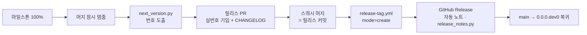

# 배포·버전관리 전략

이 문서는 이 repo에서 다음 버전을 고르고, 컷을 내고, 태그를 붙여 배포하기까지의
전략 정본입니다. 브랜치와 PR, 머지, 태그를 실제로 다루는 메커니즘은
[브랜치 작업 전략](branching.md)에 있고, 에이전트가 지켜야 할 작업 규칙과 어겨서는
안 되는 불변식은 [CLAUDE.md](../CLAUDE.md)가 정본입니다. 이 문서는 그 위에서,
무엇을 언제 하나의 릴리스로 묶고 버전 번호를 어떻게 매기는지를 담당합니다.

## 목차

- [이 전략을 고른 이유](#이-전략을-고른-이유)
- [버전 체계와 SemVer](#버전-체계와-semver)
- [릴리스 범위와 마일스톤](#릴리스-범위와-마일스톤)
- [릴리스 컷 절차](#릴리스-컷-절차)
- [CHANGELOG와 릴리스 노트](#changelog와-릴리스-노트)
- [배포와 소비](#배포와-소비)
- [예외와 다시 검토할 신호](#예외와-다시-검토할-신호)
- [관련 문서](#관련-문서)

## 이 전략을 고른 이유

이 전략은 대안 네 가지를 놓고 가중 평가와 민감도 분석까지 거친 의사결정 분석으로
골랐습니다. 요지는 두 가지입니다. 첫째, 트렁크 기반 개발과 선형 main, 한 번 붙이면
바뀌지 않는 SemVer 태그라는 이 repo의 기존 제약에 가장 잘 맞습니다. 둘째, 나중에
릴리스 주기나 릴리스 브랜치가 필요해지더라도 지금 정한 것을 되돌리지 않고 그 위에
얹을 수 있어서, 열어 두는 선택지의 가치가 가장 큽니다.

이후 #164에서 버전 넘버링 방식을 한 번 바꿨습니다. 이제 버전을 미리 확정하지
않습니다. main은 버전-중립 플레이스홀더 `0.0.0.dev0`으로 굴러가고, 번호는 컷을 낼 때
실제로 랜딩된 커밋에서 도출합니다(`feat`이면 minor, `fix`면 patch, `feat!`이나
`BREAKING`이면 0.x 구간에서 minor). 마일스톤도 스코프만 담도록 바뀌면서 제목에서
버전명을 뗐습니다. 덕분에 "이번이 patch냐 minor냐"를 사이클 시작 시점에 미리 정해
두던 마찰이 사라졌습니다. 사람 손을 거치지 않는 자동 릴리스(release-please)는
[예외와 다시 검토할 신호](#예외와-다시-검토할-신호)에 정리한 조건이 올 때까지
유예했습니다.

### 결정 요약

| 축 | 채택한 것 | 유예한 것(신호가 오면 다시 검토) |
| --- | --- | --- |
| 릴리스 모델 | 마일스톤 게이트 트렁크 — 마일스톤이 스코프를 정하고, 완성 커밋에 태그를 붙입니다(번호는 컷 때 도출) | 여러 버전을 동시에 유지해야 하면 릴리스 브랜치를 도입합니다 |
| 버전 체계 | 커밋에서 도출하는 SemVer — 버전-중립 main을 두고, 컷 때 랜딩분에서 번호를 도출하며, 0.x 관례를 따릅니다 | 사람 손 없는 릴리스가 필요하면 release-please 자동화를 얹습니다. CalVer는 이 repo에 맞지 않아 채택하지 않았습니다 |
| 배포 | repo에서 태그를 고정해 바로 가져가는 방식과 GitHub Release를 씁니다 | 외부 Python 소비자가 생기면 PyPI publish를 추가합니다 |
| 릴리스 주기 | 이벤트 구동 — 마일스톤이 완성되면 냅니다. 목표일은 가이드로만 둡니다 | 소비자가 고정 출시일을 요구하면 고정 트레인을 얹습니다 |

### 두 가지 요구를 동시에 만족시키기

- **main은 모든 변경이 모이는 곳입니다.** 버전-중립 플레이스홀더 `0.0.0.dev0`을 단
  채로 굴러가고, 릴리스는 그 위에 붙는 라벨(태그)일 뿐입니다. 릴리스가 가리키는 것은
  "지금 main 전부"가 아니라 "마일스톤이 완성된 커밋의 스냅샷"이며, 그 스냅샷의 번호는
  컷을 낼 때 도출합니다.
- **릴리스에는 정해진 항목만 들어갑니다.** 범위는 마일스톤에 붙어 있는지로
  정의합니다. 아직 완성되지 않았지만 먼저 랜딩해야 하는 변경은 기본값을 꺼 둔 채로
  넣어(예: `study.capture: off`) 릴리스 동작에 영향이 없게 합니다. 모든 변경이 모이는
  곳이면서도 실제로 켜지는 기능은 선별되는 이유가 여기 있습니다.

## 버전 체계와 SemVer

태그 `vX.Y.Z` 하나가 repo 전체 묶음(엔진과 플러그인, `actions/validate`, pre-commit)의
릴리스 하나입니다. 소비처는 별도 레지스트리를 거치지 않고 이 태그를 그대로 가져다
씁니다.

- **버전 숫자의 단일 원천은 `okf-core/pyproject.toml`의 `version`입니다.** 다만 루트
  `pyproject.toml` 셔틀에도 같은 버전이 하드코딩돼 있으므로, 릴리스할 때는 두 파일을
  모두 올려야 합니다(체크리스트에 들어 있습니다). 두 값이 같은지, 그리고 main이
  버전-중립 `0.0.0.dev0`인지는 `scripts/test_version_sync.py`가 강제합니다(CI `core`
  잡의 `pytest scripts`). 미리 minor를 올려 두면 여기서 red로 막힙니다.
- **플러그인에는 version 필드가 없습니다.** 커밋 SHA로 추적하는 `plugin.json`
  불변식 때문입니다. 그래서 플러그인의 "버전"은 소비처가 고정한 태그 그 자체입니다.
- **개발 중 main은 실제 버전을 얹지 않습니다.** 플레이스홀더 `0.0.0.dev0`으로
  굴러갑니다. 다음 번호를 미리 확정하지 않기 위해서이며, 예전처럼
  `0.(Y+1).0.dev0`으로 미리 올려 minor를 선점하지 않습니다. 릴리스할 때 컷 커밋에서
  도출한 실번호를 두 pyproject에 기입하고, 태그 `vX.Y.Z`를 붙인 다음, 곧바로 main을
  `0.0.0.dev0`으로 되돌립니다. "직전 실버전"이 무엇인지는 최신 태그 하나만 보면
  됩니다.

### 어떤 변화가 어느 자리를 올리는가 (0.x 관례)

소비자와의 계약 표면은 다음과 같습니다. §9 컨포먼스 규칙(`rules/v0_1.json`), `okf`
CLI의 서브커맨드와 플래그, 종료코드, `actions/validate`의 입력, `.okf-wiki.json`
스키마, 그리고 `index`와 `context`의 출력 형식입니다.

번호는 랜딩된 스쿼시 커밋의 타입에서 도출하며 미리 결정하지 않습니다. 컷을 낼 때
`scripts/next_version.py`가 직전 태그 이후의 로그를 읽어 아래 매핑으로 다음 번호를
제안합니다.

| 변화 | 커밋 타입 | pre-1.0 | 1.0 이후 |
| --- | --- | --- | --- |
| 계약 파괴(제거·의미 변경) | `feat!` · `fix!` · `BREAKING` | MINOR `0.Y` | MAJOR `X` |
| 하위호환 기능 추가 | `feat` | MINOR `0.Y` | MINOR |
| 버그 수정·계약 무변화 | `fix` | PATCH `0.0.Z` | PATCH |

- **0.x 승격 관례.** 1.0 이전에는 계약을 깨는 변경도 MAJOR가 아니라 MINOR로
  올립니다(`bump-minor-pre-major`). `next_version.py`가 이 관례를 그대로 구현합니다.
- `docs`, `chore`, `ci`처럼 계약이 바뀌지 않는 타입만 쌓였다면 번호를 올릴 이유가
  없습니다. 이때 `next_version.py`는 "범프 신호 없음"으로 현행 번호를 그대로
  제안하는데, 이는 릴리스를 보류하라는 신호입니다.

> **주의.** `rules/v0_1.json`의 "v0.1"은 벤더로 가져온 OKF 스펙의 준거 레벨, 즉 스펙
> 버전이지 이 툴셋의 릴리스 버전이 아닙니다. 둘은 서로 독립적으로 움직입니다.

## 릴리스 범위와 마일스톤

마일스톤은 무엇을 만들지, 즉 스코프와 기획만 담고 버전명은 붙이지 않습니다. 버전
번호는 컷을 낼 때 랜딩분에서 도출하므로
([0.x 관례](#어떤-변화가-어느-자리를-올리는가-0x-관례)), 마일스톤 제목에 `vX.Y.Z`를
박아 patch인지 minor인지 미리 정해 두지 않습니다.

- GitHub 마일스톤을 만들고(제목은 스코프명, 예를 들면 `study 스테이징 재설계`) 여기에
  들어갈 이슈와 Epic, 유닛을 붙입니다. 이 목록이 "이번 릴리스에 포함되는 항목"의 단일
  원천입니다.
- **릴리스 준비가 끝났다는 것은 마일스톤이 100% 닫혔다는 뜻입니다.** 목록에 없으면
  이번 릴리스 대상이 아닙니다. 버전 번호는 바로 이 시점에 도출합니다. 마일스톤이
  정하는 것은 범위이지 번호가 아닙니다.
- 목표일을 둘 수는 있지만 목표일이 컷을 강제하지는 않습니다. 게이트는 날짜가 아니라
  마일스톤 완성입니다. 그래서 "정해진 항목만 릴리스"라는 원칙이 구조적으로
  지켜집니다.

### 마일스톤 만들고 이슈 붙이기

**언제 만드나.** 사이클을 시작할 때, 범위가 정해지면 마일스톤을 먼저 만들고 이슈를
붙입니다. Epic이라면 Epic과 유닛을 모두 같은 마일스톤에 붙입니다.

**어떻게 만드나.** 제목은 스코프명으로 하고 버전명은 쓰지 않습니다. UI에서는 repo의
Issues 탭에서 Milestones로 들어가 New milestone을 누릅니다. `gh`로 만들 때는 다음
명령을 씁니다.

```bash
gh api repos/<owner>/<repo>/milestones -f title="<스코프명>" -f state=open -f description="<한 줄 요약>"
```

**어떻게 붙이나.** 이슈나 PR의 Milestone 필드를 그 마일스톤으로 지정합니다.

```bash
gh issue edit <N> --milestone "<스코프명>"
```

API를 쓴다면 `PATCH .../issues/<N>`에 `milestone=<번호>`를 보냅니다. 이미 닫힌
이슈에도 붙일 수 있어서 나중에 그룹으로 묶는 것도 가능합니다.

> **주의.** GitHub MCP에는 마일스톤을 만드는 도구가 없습니다(조회와 이슈, PR, 브랜치만
> 다룹니다). 그래서 마일스톤 생성은 사람이 UI나 `gh`로 하고, 에이전트는 그 뒤에 이슈를
> 붙이는 일(issue update의 `milestone` 번호)만 합니다. 이때 넣는 값은 제목이 아니라
> 번호이며, 번호는 마일스톤 URL `.../milestone/<N>`에서 확인할 수 있습니다. 기존
> 마일스톤 번호와 헷갈리지 않도록 반드시 URL로 확인합니다.

## 릴리스 컷 절차


```mermaid
flowchart LR
  M[마일스톤 100%] --> F[머지 잠시 멈춤]
  F --> V[next_version.py<br/>번호 도출]
  V --> R[릴리스 PR<br/>실번호 기입 + CHANGELOG]
  R --> S[스쿼시 머지<br/>= 릴리스 커밋]
  S --> T[release-tag.yml<br/>mode=create]
  T --> G[GitHub Release<br/>자동 노트 · release_notes.py]
  G --> N[main → 0.0.0.dev0 복귀]
```

1. **머지 잠시 멈추기** — 마일스톤이 닫히면 다음 버전에 들어갈 머지를 잠깐 멈춥니다.
   다음 버전 몫이 이번 릴리스에 섞여 드는 것을 막기 위해서입니다.
2. **번호 도출** — `python3 scripts/next_version.py`를 돌려 직전 태그 이후의
   랜딩분에서 다음 `vX.Y.Z`를 도출합니다. 미리 정해 둔 번호를 쓰는 것이 아닙니다.
   스크립트가 내는 것은 제안이므로 검토해서 확정합니다.
3. **릴리스 PR** — `okf-core/pyproject.toml`과 루트 셔틀의 플레이스홀더에 도출된
   실번호를 기입하고, `CHANGELOG.md`를 갱신하고, `okf validate .okf --strict`와 테스트를
   다시 확인합니다. 스쿼시 머지한 이 커밋이 릴리스 지점이 됩니다.
4. **태그** — main에서 `release-tag.yml`을 `mode=create tag=vX.Y.Z`로 dispatch합니다.
   태그는 Actions 안에서 그 커밋에 생성되고, 한 번 만들어지면 바뀌지 않습니다. 원격
   세션 프록시가 `refs/tags` 푸시를 막기 때문에 이 경로가 유일한 방법입니다. 같은
   태그가 이미 있으면 워크플로가 중단됩니다.
5. **(관례) 보호 실증** — 필요하면 `mode=verify-protection`으로 태그 삭제와 이동이
   실제로 막히는지 일부러 시도해 확인합니다. 배경은
   [branching.md의 파괴 감지 검사](branching.md#파괴-감지-검사)에 있습니다.
6. **GitHub Release** — `release-tag.yml`의 `mode=create`가 태그를 만든 직후
   `scripts/release_notes.py` 출력으로 Release를 자동 발행합니다. 소비처가 참조하는
   지점입니다. 따로 수동으로 발행할 필요는 없고, 문구를 다듬고 싶으면 발행된 Release를
   편집하면 됩니다.
7. **버전-중립으로 복귀** — main의 두 pyproject를 `0.0.0.dev0`으로 되돌리는 후속
   커밋을 올립니다. 다음 minor를 미리 박아 두지 않습니다.

### 릴리스 체크리스트

- [ ] 마일스톤 생성(제목은 스코프명, 버전명 금지) — 사람이 UI나 `gh`로 만들고 대상 이슈·Epic·유닛 부착
- [ ] 마일스톤 100% 닫힘 확인, 스코프 밖 항목이 없는지 확인
- [ ] `python3 scripts/next_version.py`로 다음 `vX.Y.Z` 도출·확정
- [ ] `okf-core/pyproject.toml`에 도출 번호 기입, 루트 `pyproject.toml`도 같은 값으로 동기화
- [ ] `CHANGELOG.md` 갱신 — `scripts/release_notes.py` 출력을 검수해 붙여넣기(생성법은 [CHANGELOG와 릴리스 노트](#changelog와-릴리스-노트))
- [ ] `core` 잡 녹색 확인, `okf validate .okf --strict`의 error·warn 0건 확인
- [ ] `release-tag.yml mode=create`로 태그 생성, GitHub Release 자동 발행 확인(로컬 태그 푸시 금지)
- [ ] 발행된 Release 본문 확인, 소비 예시의 태그 고정 갱신 확인(`actions/validate@vX.Y.Z`, pre-commit `rev`)
- [ ] main의 두 pyproject를 `0.0.0.dev0`으로 복귀

## CHANGELOG와 릴리스 노트

스쿼시 머지를 쓰기 때문에 태그와 태그 사이의 `main` 로그는 PR 한 건이 한
줄(`type(scope): 제목 (#NN)`)입니다. `scripts/release_notes.py`가 이 로그를 파싱해서
추가(`feat`)와 수정(`fix`), 문서(`docs`), 기타로 묶은 마크다운을 냅니다. 예전에
`git log --pretty`를 돌리고 prefix로 직접 묶던 작업을 자동화한 것으로, 표준
라이브러리만 쓰고 외부 의존이 없으며 오프라인에서 결정론적으로 동작합니다. 버전
범프나 릴리스 커밋에 해당하는 `chore`와 `release`는 기본적으로 제외합니다.

```bash
python3 scripts/release_notes.py                # 직전 태그..HEAD (다음 릴리스 미리보기)
python3 scripts/release_notes.py --to v0.4.0    # v0.3.0..v0.4.0 (특정 릴리스 재생성)
python3 scripts/release_notes.py --from v0.1.0 --to HEAD --all   # 범위·제외타입 지정
```

- **GitHub Release 본문은 태그를 만들 때 자동으로 발행됩니다.** `release-tag.yml`의
  `mode=create`가 태그를 만든 직후 이 스크립트 출력으로 Release를 만듭니다
  ([릴리스 컷 절차](#릴리스-컷-절차)의 GitHub Release 단계). 더 이상 수동 작업이
  아니며, 문구를 다듬고 싶으면 발행된 Release를 편집합니다.
- `CHANGELOG.md` 파일의 섹션은 아직 사람이 이 출력을 검수해서 붙여넣습니다(릴리스 PR
  단계). 산문을 다듬거나 Epic 단위로 묶을 여지를 남겨 두기 위해서입니다. 파일까지
  완전히 자동으로 만드는 일은 후속 과제(#142)로 남겨 뒀습니다.

## 배포와 소비

- 소비처는 이 repo의 태그를 고정해서 바로 가져다 씁니다. GitHub Actions에서는
  `uses: pmmm114/okf-wiki-plugin/actions/validate@vX.Y.Z`로, pre-commit에서는
  `rev: vX.Y.Z`로 씁니다. 레지스트리에 publish하지는 않으며, 엔진이 필요하면
  `pip install ./okf-core`를 쓰거나 repo 루트를 설치합니다.
- 사람이 들어오는 입구는 GitHub Release입니다. 릴리스 노트와 자산이 여기 모입니다.
  CI의 `uv build`가 만든 wheel을 Release 자산으로 첨부할 수도 있습니다(선택).

## 예외와 다시 검토할 신호

아래 신호가 오면 이 전략을 다시 검토합니다. 신호가 오기 전에는 얹지 않습니다.

- **여러 버전을 함께 유지해야 할 때** — 구 메이저를 패치하면서 새 메이저를 개발해야
  한다면, 해당 메이저에 한해 `release/vX.Y` 릴리스 브랜치와 백포트를 도입합니다.
- **외부 Python 소비자가 등장할 때** — `okf-core`를 PyPI에
  publish합니다(trusted publishing).
- **소비자가 고정된 출시일을 요구할 때** — 마일스톤 위에 고정된 릴리스
  주기(트레인)를 덧씌웁니다.
- **사람 손을 거치지 않는 릴리스나 잦은 릴리스 주기가 필요할 때** — 지금의 수동
  도출(`next_version.py`) 위에 커밋에서 번호를 도출하는 자동화(release-please)를
  얹습니다. 지금은 리뷰 게이트를 거치는 문화에, 패키지가 하나뿐이고, 태그를
  프록시(`release-tag.yml`)로만 만들 수 있는 제약까지 감안하면 과하다고 보아
  유예했습니다. #164에서 검토한 결론입니다.
- **1.0에 도달할 때** — 계약을 깨는 변경이 MAJOR로 승격되고, 안정성 약속을 문서로
  남깁니다.

## 관련 문서

| 문서 | 무슨 내용인지 |
| --- | --- |
| [브랜치 작업 전략](branching.md) | 브랜치와 커밋, PR, 스쿼시 머지, 태그 메커니즘, 벤더 반영 |
| [CONTRIBUTING.md](../CONTRIBUTING.md) | 컨포먼스와 회귀 계약, 엔진 CLI, 로컬에서 재현하기 |
| [CLAUDE.md](../CLAUDE.md) | 에이전트가 지켜야 할 작업 규칙과 어겨서는 안 되는 불변식의 정본 |
| [CHANGELOG.md](../CHANGELOG.md) | 릴리스별 변경 내역 |
| [README](../README.md) | 프로젝트 전체 소개와 문서 목록 |
