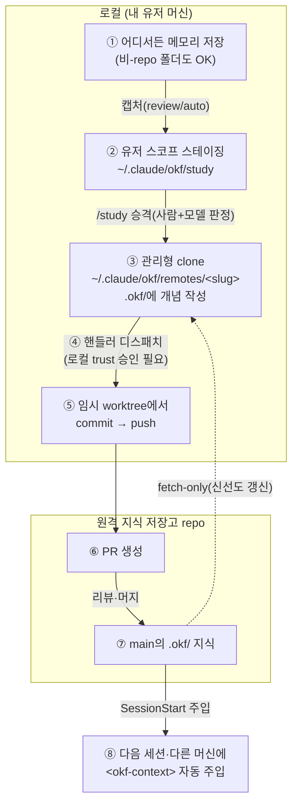

# 원격 지식 저장고(vault) — 어디서든 캡처하고 원격 repo에 지식 쓰기

지식을 담을 repo 안에서만 쓰는 게 아니라, **git이 아닌 스크래치 폴더나 설정 없는
다른 repo에서 일하다가도** 알아낸 걸 한곳(원격 지식 저장고)에 모으고 싶을 때가
있어요. 이 문서는 그 흐름을 처음부터 끝까지, 그림 한 장과 체크리스트로 설명해요.

- 처음이라면 [Getting Started](../README.md#getting-started)로 repo 안 기본 흐름을 먼저
  해 보는 걸 권해요. 이 문서는 그다음, **"내 repo 밖"**과 **"원격 저장고"**로 넓히는 단계예요.
- 이 문서는 vault 사용법(따라 하기)의 정본이에요. 설정 항목·스코프 해소 규칙의
  정본은 [CONFIG.md](../plugins/okf/skills/okf/reference/CONFIG.md), `study` 도입 전반은
  [study 도입 가이드](adopting-study.md)에 있어요.

## 한눈에 보기



핵심은 **경계**예요. ①~⑤는 전부 내 유저 머신 안에서 일어나고, 원격 repo에 실제로
닿는 건 ⑤의 `push`와 ⑥의 PR뿐이에요. 그래서 오프라인이어도 읽기(⑧)는 clone 캐시로
계속되고, 네트워크가 없을 땐 PR만 잠깐 보류돼요.

## vault가 뭐예요

**vault(지식 저장고)** 는 지식이 모이는 **순수 목적지 repo**예요. 자기 `.okf/`
번들과 `.okf-wiki.json`을 가진 진짜 git repo면 돼요. 런타임(후보 큐·원장·trust) 같은
잠깐 쓰는 상태는 vault에 만들지 않고 유저 스코프에 따로 둬요 — vault는 큐레이션된
지식만 담아요.

vault를 가리키는 **포인터**는 현재 작업 위치(cwd)와 상관없는 **유저 스코프**에 있어요.

```
~/.claude/okf/vault-project      # 한 줄: vault repo 절대경로 또는 repo URL
```

바로 이 포인터가 유저 스코프라서 **비-repo 폴더에서도** vault가 잡혀요. 값은 두 가지
중 하나예요.

- **로컬 경로**: 이미 clone해 둔 vault repo의 절대경로.
- **repo URL**(권장, ssh/https/git/file): 플러그인이 알아서 유저 스코프에 **관리형
  clone**(`~/.claude/okf/remotes/<slug>`)을 두고 관리해요. clone 위치를 직접 정할 필요가
  없고, 설정이 머신 간 그대로 이식돼요(로컬 절대경로는 머신마다 다르니까요).

이 문서는 주로 **URL(관리형 clone)** 경우를 다뤄요. "원격 repo에 PR"이 자연스럽게
붙는 쪽이거든요.

## 읽기는 왜 바로 되고, 쓰기는 뭐가 더 필요해요

포인터만 URL로 걸고 clone을 한 번 만들어 두면 **읽기(주입)는 곧바로** 돼요. 관리형
clone의 캐시에서 `<okf-context>`를 뽑아 세션에 넣어 주거든요. 오프라인이어도 캐시로 계속돼요.

**쓰기(캡처·승격)** 는 한 단계 더 필요해요. `/study` 승격은 개념을 관리형 clone에
**로컬로 쓰긴** 하지만, 그게 **원격 repo에 반영(PR)** 되려면 그 push를 실제로 하는
**핸들러**가 있어야 해요. 플러그인은 목적지를 모르거든요 — "어디로, 어떻게 PR을
여는가"는 소비처가 붙인 핸들러의 몫이에요.

## 어디서 캡처하면 어디로 가나요

슬로건은 하나예요. **"자기 파이프라인이 있으면 거기로, 없으면 vault로."**

| 내가 있는 곳 | 캡처(스테이징) | 주입(읽기) |
| --- | --- | --- |
| `study` 블록 있는 repo | 그 repo `.okf-study/` | 그 repo 번들 |
| `scope: "vault"` 선언 repo | **유저 스코프** | 그 repo 번들 |
| 주입 전용 설정 repo(study 블록 없음) | **유저 스코프** | 그 repo 번들 |
| **무설정 repo · 비-repo 폴더** | **유저 스코프** | **vault** 번들 |
| vault repo 자신 | **유저 스코프** | vault 번들 |

승격(`/study`)은 언제나 vault의 `.okf/`로 가요. 한 이벤트의 스코프는 항상 정확히
하나라서 이중 캡처는 없고, 벽을 넘고 싶을 때만 `/study --scope vault|project`로
명시해요.

## 원격 main에 뭘 둬야 하나요 (체크리스트)

가장 헷갈리는 지점이에요. "완전한 쓰기 루프"를 능력별로 쪼개면 무엇이 원격 main에
있어야 하고 무엇이 로컬인지 갈려요.

| 능력 | 원격 main에 필요 | 로컬/유저 스코프 |
| --- | --- | --- |
| **읽기(주입)** | `.okf/` 번들 + `.okf-wiki.json` | 관리형 clone(fetch 캐시) |
| **로컬 승격**(clone에 개념 쓰기) | — (원격 없이도 씀) | `/study` |
| **원격 반영(PR)** | **`okf-open-pr.py` + `study.handlers` 배선** | **trust 승인**(`/study --trust`, 머신별) |
| **자동 캡처**(메모리→후보 스테이징) | **`study.capture: review` 또는 `auto`** | 스테이징은 유저 스코프 |

세 가지만 기억하면 돼요.

1. **핸들러 스크립트 + 배선은 원격 main 필수.** 디스패치가 핸들러를 **repo 트리 안 +
   git 추적** 경로로 요구해요(미추적이면 거부, fail-closed). 게다가 URL vault의 관리형
   clone은 원격(origin)의 미러라, 거기에 로컬로 커밋하면 diverge돼서 신선도 갱신이
   막혀요. 그래서 핸들러 스크립트(`scripts/okf-open-pr.py`)와 그 배선
   (`.okf-wiki.json`의 `study.handlers`) **둘 다 원격 main에 커밋**돼야 정상 동작해요.
   이게 "로컬 승격 → 원격 persist(PR)"의 마지막 고리예요.

2. **`study.capture`는 "자동 캡처"를 원할 때만 필수.** URL vault는 관리형 clone이라
   로컬에서 캡처를 켜는 걸(`enable-capture`) 거부해요(diverge 방지). 자동 캡처를 켜려면
   **원격 repo에 `study.capture: review`(또는 `auto`)를 커밋**하고 다음 세션 fetch로
   반영해요. 단 이건 필수 전제가 아니에요 — `off`여도 수동 `/study --scope vault`로
   개념을 쓸 수 있어요(MEMORY.md·명시 요청 기반). 캡처 사다리는 "후보를 자동으로
   모으느냐"의 문제일 뿐, 쓰기 자체를 막지 않아요.

3. **trust는 원격이 아니라 로컬이에요.** 핸들러가 원격 main에 있어도, **프레시 clone은
   늘 미승인에서 시작**해요. 승인은 유저 스코프에 핸들러 내용 해시로 저장되고 커밋
   대상이 아니에요. 그래서 **머신마다 한 번** `/study --trust`가 필요하고, 스크립트
   바이트가 바뀌면 재승인해야 해요.

> 핸들러를 원격에 안 두면 어떻게 되냐면 — `/study` 승격이 개념을 관리형 clone에
> 쓰긴 하지만 **미커밋·로컬 전용**이라 원격에 닿지 않고, clone이 dirty로 남아 다음
> 신선도 갱신(ff)까지 막혀요. 즉 쓰기가 로컬에 갇히고 clone을 정체시켜요.

## 따라 하기: 셋업

### 1. vault 포인터 걸고 clone 만들기 (옵트인)

```
/okf-init --vault <원격 vault repo URL>
```

URL을 포인터에 기록하고, **동의를 받아** 관리형 clone을 만들어요(플러그인이 임의로
clone하지 않아요). `https`·`ssh`·`git`·`file`만 허용하고, `user:token@` 크레덴셜은
포인터에 저장하지 않아요(git credential helper·ssh-agent에 위임). 원격 repo에 아직
`.okf/`·`.okf-wiki.json`이 없으면 먼저 그 골격을 갖춰야 해요.

### 2. 원격 repo에 핸들러 커밋하기

> **딸깍:** 앞의 `/okf-init --vault`가 이 핸들러(`origin`에 PR을 여는 무참조 Python 골격)와
> `study.handlers`·`study.capture` 배선을 **한 번에 깔아 줘요**. 그러면 이 단계는 diff 검수
> 후 커밋·push만 남아요(URL vault면 브랜치→PR). 아래는 그 산출물을 직접 이해·수정하고
> 싶을 때 참고예요.

참조 골격이 [`examples/okf-open-pr.py.example`](examples/okf-open-pr.py.example)에 있어요
(**표준 라이브러리 Python 자체완결형** — 딸깍 스캐폴드가 까는 것과 **같은** 핸들러예요).
**그대로 쓰는 활성 핸들러가 아니라** 소비처가 자기 커밋 경로(예: `scripts/okf-open-pr.py`)로
복사·수정하는 뼈대예요. 목적지 repo는 하드코딩하지 말고, 파일 상단 **정책 상수
(base·리뷰어·라벨)만** 채워 넣어요.

URL vault에서 특히 중요한 건 **격리**예요. 관리형 clone은 유저 스코프의 단일 자원
이라, 핸들러가 그 체크아웃 브랜치를 바꾸거나 미커밋 잔재를 남기면 이후 신선도
갱신이 막혀요. 그래서 참조 핸들러는 **임시 `git worktree`**에서만 커밋·push하고,
push 성공 뒤 원 clone 워킹트리를 clean으로 되돌려요(승격 잔재를 남기지 않아 이후 ff
신선도 갱신을 막지 않아요). 구체 골격·계약 주석은 위 예시 파일에 있어요.

핸들러가 받는 계약(stdin JSON + env var)과 실행 cwd(=승격 대상 repo 루트, URL vault
에선 관리형 clone)의 상세는 [study 도입 가이드 §4](adopting-study.md#4-핸들러-계약)에 있어요.

### 3. 배선과 캡처 설정을 원격 main에 커밋하기

원격 vault repo의 `.okf-wiki.json`에 이렇게 넣고 커밋해요.

```json
{
  "study": {
    "capture": "review",
    "handlers": [{ "name": "kb-pr", "command": "scripts/okf-open-pr.py" }]
  }
}
```

- `handlers[].command`는 **git에 커밋된 repo 내 경로**여야 해요.
- `capture: "review"`는 자동 캡처를 원할 때만요(수동만 쓸 거면 생략 가능).

### 4. 로컬에서 trust 승인하기 (머신별)

```
/study --trust
```

핸들러 내용 해시가 유저 스코프에 저장돼요. 미승인이면 개념은 승격·검증되지만
**핸들러 실행(=PR)만 보류**돼요("N개 승격됨; `/study --trust`로 승인" 안내가 떠요).

### 5. push 인증 준비하기

핸들러가 `push`·PR을 하니까, 로컬에 `gh` 인증이나 credential helper·ssh-agent가
세팅돼 있어야 해요. 플러그인은 인증을 위임만 하고 토큰을 저장하지 않아요.

### 6. 써 보기

이제 비-repo 폴더에서도 메모리를 저장하면 유저 스코프에 후보가 쌓이고, `/study`로
골라 승격하면 관리형 clone에 개념이 쓰이고 핸들러가 원격 repo에 PR을 열어요. 지금
위치에서 캡처·주입이 어디로 가는지 궁금하면 `/okf-doctor`로 확인해요.

## 신선도·오프라인·주의점

- **신선도 갱신은 두 지점**에서만 네트워크를 써요. SessionStart는 **fetch-only**(origin
  ref만, 워킹트리 불변, TTL로 중복 억제)이고, 워킹트리 갱신(ff-only)은 `/study` 진입
  에서 **clean-gate**(미커밋 잔재 없음)를 통과할 때만 해요. 매 `.md` 저장 훅은 네트워크를
  타지 않아요(순수 분류기).
- **오프라인·인증 실패는 fail-closed가 아니에요.** 주입은 clone 캐시로 계속되고 **PR만
  보류**돼요. 한 줄 경고가 뜨고, 네트워크가 회복되면 이어져요. `OKF_REMOTE_OFFLINE=1`로
  fetch를 강제로 끌 수 있어요.
- **dirty clone 경고.** 이전 승격을 핸들러가 아직 커밋 안 해서 clone에 미커밋 잔재가
  있으면, `/study` 진입 시 갱신을 건너뛰고 경고해요. 디스패치(커밋)하거나 폐기해서
  정리한 뒤 다시 하면 돼요(강제 stash·머지는 clone을 망가뜨리니 안 해요).
- **이원화 주의.** 같은 원격을 URL 모드로도, 로컬 경로로도 가리키면 지식이 두 clone
  으로 갈려요. `/okf-doctor`가 이걸 무네트워크로 감지·안내해요.

## 자주 막히는 곳

| 증상 | 원인 | 해결 |
| --- | --- | --- |
| 주입은 되는데 승격이 원격에 안 올라가요 | 핸들러 미배선/미승인 | 원격 main에 핸들러 커밋 + `/study --trust` |
| "N개 승격됨; `/study --trust`로 승인" | trust 미승인(이 머신) | `/study --trust` (머신마다 1회) |
| clone 미생성이라 나와요 | 포인터만 URL, clone 옵트인 안 함 | `/okf-init --vault <url>`로 동의 후 생성 |
| 자동 캡처가 안 켜져요(URL vault) | 로컬 `enable-capture` 거부(diverge 방지) | 원격 repo에 `study.capture` 커밋 → fetch |
| 갱신이 자꾸 건너뛰어요 | dirty clone(승격 잔재) | 디스패치(커밋) 또는 폐기 후 재시도 |
| PR 단계에서 인증 실패 | `gh`/credential helper 미설정 | 로컬 push 인증 세팅 |

## 더 보기

| 문서 | 무슨 내용인지 |
| --- | --- |
| [study 도입 가이드](adopting-study.md) | 설치부터 핸들러 계약(§4)·trust(§5)·vault 폴백(§7)까지 |
| [CONFIG.md](../plugins/okf/skills/okf/reference/CONFIG.md) | `.okf-wiki.json` 설정 항목 전체와 스코프 해소 규칙(정본) |
| [참조 핸들러 템플릿](examples/okf-open-pr.py.example) | 계약을 실증하는 PR 핸들러 뼈대(복사·수정용) |
| [소비 repo 가이드](consuming.md) | 가져다 쓰는 repo에서 CI·pre-commit으로 검증하기 |

> 구현 근거: vault 폴백·전역 원장·doctor(Epic #91), 런타임 유저 스코프 분리·vault 순수
> 목적지(#114), URL 포인터 모드·관리형 clone(#153). 정확한 규약·스키마·침묵 정책의
> 정본은 [CONFIG.md](../plugins/okf/skills/okf/reference/CONFIG.md)의 "Vault 프로젝트 폴백" 절이에요.
