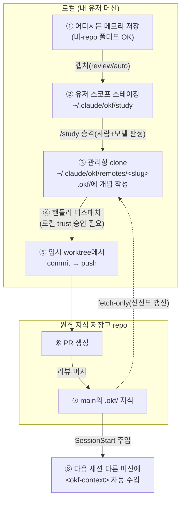

# 원격 지식 저장고(vault) — 어디서든 캡처하고 원격 repo에 지식 쓰기

이 문서는 지식을 담을 repo **바깥에서 일할 때도** 알아낸 것을 한곳에 모으는
방법을 설명합니다. git repo가 아닌 스크래치 폴더에서 작업하든, okf 설정이 없는
다른 repo에서 작업하든, 캡처한 지식은 원격 지식 저장고(vault) 하나로 모입니다.
전체 흐름을 그림 한 장과 체크리스트로 처음부터 끝까지 따라가 봅니다.

> **먼저 볼 것.** okf가 처음이라면 [README](../README.md)의 Getting Started로
> repo 안에서 도는 기본 흐름을 먼저 해 보시길 권합니다. 이 문서는 그다음
> 단계로, 범위를 "내 repo 밖"과 "원격 저장고"까지 넓히는 이야기입니다.

이 문서는 vault를 실제로 어떻게 쓰는지, 즉 따라 하기의 정본입니다. 설정 항목과
스코프 해소 규칙의 정본은
[CONFIG.md](../plugins/okf/skills/okf/reference/CONFIG.md)에 있고, `study` 도입
전반은 [study 도입 가이드](adopting-study.md)에 있습니다.

## 목차

- [한눈에 보기](#한눈에-보기)
- [vault란 무엇인가](#vault란-무엇인가)
- [읽기와 쓰기에 필요한 것](#읽기와-쓰기에-필요한-것)
- [위치별로 어디에 쌓이는가](#위치별로-어디에-쌓이는가)
- [원격 main에 있어야 하는 것](#원격-main에-있어야-하는-것)
- [따라 하기: 셋업](#따라-하기-셋업)
- [신선도와 오프라인, 주의점](#신선도와-오프라인-주의점)
- [자주 막히는 곳](#자주-막히는-곳)
- [관련 문서](#관련-문서)

## 한눈에 보기


```mermaid
flowchart TD
    subgraph local["로컬 (내 유저 머신)"]
        A["① 어디서든 메모리 저장<br/>(비-repo 폴더도 OK)"] -->|"캡처(review/auto)"| B["② 유저 스코프 스테이징<br/>~/.claude/okf/study"]
        B -->|"/study 승격(사람+모델 판정)"| C["③ 관리형 clone<br/>~/.claude/okf/remotes/&lt;slug&gt;<br/>.okf/에 개념 작성"]
        C -->|"④ 핸들러 디스패치<br/>(로컬 trust 승인 필요)"| D["⑤ 임시 worktree에서<br/>commit → push"]
    end
    subgraph remote["원격 지식 저장고 repo"]
        E["⑥ PR 생성"] -->|"리뷰·머지"| F["⑦ main의 .okf/ 지식"]
    end
    D --> E
    F -.->|"fetch-only(신선도 갱신)"| C
    F -->|"SessionStart 주입"| G["⑧ 다음 세션·다른 머신에<br/>&lt;okf-context&gt; 자동 주입"]
```

여기서 핵심은 **경계**입니다. ①부터 ⑤까지는 전부 내 유저 머신 안에서 일어나고,
원격 repo에 실제로 닿는 것은 ⑤의 `push`와 ⑥의 PR뿐입니다. 그래서 오프라인이어도
읽기(⑧)는 clone 캐시로 계속 돌아가고, 네트워크가 없을 때는 PR만 잠깐 보류됩니다.

## vault란 무엇인가

vault(지식 저장고)는 지식이 모이는 **순수 목적지 repo**입니다. 자기 `.okf/`
번들과 `.okf-wiki.json`을 가진 진짜 git repo면 됩니다. 후보 큐와 원장, trust처럼
잠깐 쓰다 버리는 런타임 상태는 vault에 만들지 않고 유저 스코프에 따로 둡니다.
vault에는 골라 올린 지식만 담깁니다.

vault를 가리키는 **포인터**는 현재 작업 위치(cwd)와 상관없는 유저 스코프에
있습니다.

```
~/.claude/okf/vault-project      # 한 줄: vault repo 절대경로 또는 repo URL
```

바로 이 포인터가 유저 스코프에 있기 때문에 git repo가 아닌 폴더에서도 vault가
잡힙니다. 값으로는 다음 두 가지 중 하나를 씁니다.

- **로컬 경로** — 이미 clone해 둔 vault repo의 절대경로입니다.
- **repo URL**(권장하는 쪽이며 ssh, https, git, file을 지원합니다) — 플러그인이
  알아서 유저 스코프에 **관리형 clone**(`~/.claude/okf/remotes/<slug>`)을 두고
  관리합니다. clone 위치를 직접 정할 필요가 없고, 머신마다 값이 달라지는 로컬
  절대경로와 달리 설정을 그대로 다른 머신으로 옮길 수 있습니다.

이 문서는 주로 URL을 써서 관리형 clone을 두는 경우를 다룹니다. "원격 repo에
PR을 연다"는 흐름이 자연스럽게 붙는 쪽이기 때문입니다.

## 읽기와 쓰기에 필요한 것

포인터를 URL로 걸고 clone을 한 번 만들어 두면 **읽기(주입)는 곧바로** 됩니다.
관리형 clone의 캐시에서 `<okf-context>`를 뽑아 세션에 넣어 주기 때문입니다.
오프라인이어도 이 캐시로 계속 읽힙니다.

**쓰기(캡처와 승격)** 는 한 단계가 더 필요합니다. `/study` 승격은 개념을 관리형
clone에 로컬로 쓰기는 하지만, 그것이 원격 repo에 PR로 반영되려면 그 push를 실제로
수행하는 **핸들러**가 있어야 합니다. 플러그인은 목적지를 모릅니다. 어디로 어떻게
PR을 여는지는 소비처가 붙인 핸들러의 몫입니다.

## 위치별로 어디에 쌓이는가

규칙은 한 문장으로 요약됩니다. **자기 파이프라인이 있으면 거기로, 없으면
vault로** 갑니다.

| 작업 위치 | 캡처(스테이징) | 주입(읽기) |
| --- | --- | --- |
| `study` 블록 있는 repo | 그 repo `.okf-study/` | 그 repo 번들 |
| `scope: "vault"` 선언 repo | 유저 스코프 | 그 repo 번들 |
| 주입 전용 설정 repo(study 블록 없음) | 유저 스코프 | 그 repo 번들 |
| **무설정 repo와 비-repo 폴더** | 유저 스코프 | **vault** 번들 |
| vault repo 자신 | 유저 스코프 | vault 번들 |

승격(`/study`)은 언제나 vault의 `.okf/`로 갑니다. 한 이벤트의 스코프는 항상
정확히 하나뿐이라 같은 내용이 두 곳에 이중으로 캡처되는 일은 없습니다. 이 벽을
넘어야 할 때만 `/study --scope vault|project`로 스코프를 명시합니다.

## 원격 main에 있어야 하는 것

여기가 가장 헷갈리는 지점입니다. 완전한 쓰기 루프를 능력별로 쪼개어 보면,
무엇이 원격 main에 있어야 하고 무엇이 로컬에만 있으면 되는지가 갈립니다.

| 능력 | 원격 main에 필요한 것 | 로컬과 유저 스코프에 필요한 것 |
| --- | --- | --- |
| 읽기(주입) | `.okf/` 번들과 `.okf-wiki.json` | 관리형 clone(fetch 캐시) |
| 로컬 승격(clone에 개념 쓰기) | 필요 없음(로컬 clone에만 기록) | `/study` |
| **원격 반영(PR)** | **`okf-open-pr.py`와 `study.handlers` 배선** | trust 승인(`/study --trust`, 머신별) |
| 자동 캡처(메모리에서 후보 스테이징까지) | **`study.capture: review` 또는 `auto`** | 유저 스코프 스테이징 |

세 가지만 기억하면 됩니다.

1. **핸들러 스크립트와 배선은 원격 main에 반드시 있어야 합니다.** 디스패치는
   핸들러가 repo 트리 안에 있으면서 git으로 추적되는 경로일 것을 요구하고,
   추적되지 않으면 거부합니다(fail-closed — 확실하지 않으면 통과시키지 않습니다).
   게다가 URL vault의 관리형 clone은 원격(origin)의 미러라서, 거기에 로컬로
   커밋하면 원격과 갈라지고 그러면 신선도 갱신이 막힙니다. 그래서 핸들러 스크립트인
   `scripts/okf-open-pr.py`와 그 배선인 `.okf-wiki.json`의 `study.handlers`가
   둘 다 원격 main에 커밋돼 있어야 정상 동작합니다. 이것이 로컬 승격을 원격에
   PR로 남기는 마지막 고리입니다.

2. **`study.capture`는 자동 캡처를 원할 때만 필요합니다.** URL vault는 관리형
   clone이라 로컬에서 캡처를 켜는 `enable-capture`를 거부합니다. 원격과 갈라지는
   것을 막기 위해서입니다. 자동 캡처를 켜려면 원격 repo에
   `study.capture: review`(또는 `auto`)를 커밋하고 다음 세션의 fetch로 반영합니다.
   다만 이것은 필수 전제가 아닙니다. `off`여도 수동으로
   `/study --scope vault`를 실행하면 MEMORY.md나 명시적인 요청을 근거로 개념을
   쓸 수 있습니다. 캡처 단계는 후보를 자동으로 모을지 말지의 문제일 뿐, 쓰기
   자체를 막지 않습니다.

3. **trust는 원격이 아니라 로컬에 있습니다.** 핸들러가 원격 main에 있더라도 새로
   clone한 저장소는 늘 미승인 상태에서 시작합니다. 승인은 핸들러 내용의 해시로
   유저 스코프에 저장되고 커밋 대상이 아니기 때문입니다. 그래서 머신마다 한 번씩
   `/study --trust`가 필요하고, 스크립트 바이트가 바뀌면 다시 승인해야 합니다.

> **핸들러를 원격에 두지 않으면.** `/study` 승격이 개념을 관리형 clone에 쓰기는
> 하지만 커밋되지 않은 로컬 전용 변경으로 남아 원격에 닿지 않습니다. 쓰기가 로컬에
> 갇힙니다. 다만 그 잔재가 신선도 갱신을 **영구히 막지는 않습니다** — 갱신은
> 충돌하는 경로가 있을 때만 멈추고, 그때도 원격에 이미 담긴 잔재는 스스로
> 정리합니다([신선도와 오프라인](#신선도와-오프라인-주의점)).

## 따라 하기: 셋업

### 1. vault 포인터 걸고 clone 만들기 (사용자 동의 필요)

```
/okf-init --vault <원격 vault repo URL>
```

이 명령은 URL을 포인터에 기록하고, 사용자가 동의해야 관리형 clone을 만듭니다.
플러그인이 임의로 clone하는 일은 없습니다. 허용하는 스킴은 `https`와 `ssh`,
`git`, `file`뿐이고, `user:token@` 형태의 크레덴셜은 포인터에 저장하지 않습니다.
인증은 git credential helper와 ssh-agent에 위임합니다. 원격 repo에 아직 `.okf/`와
`.okf-wiki.json`이 없다면 먼저 그 골격부터 갖춰야 합니다.

### 2. 원격 repo에 핸들러 커밋하기

> **딸깍 스캐폴드.** 여기서 "딸깍"은 명령 한 번으로 필요한 것이 한꺼번에 깔리는
> 것을 가리킵니다. 앞 단계의 `/okf-init --vault`가 이 핸들러(`origin`에 PR을 여는
> 무참조 Python 골격)와 `study.handlers`, `study.capture` 배선을 한 번에 깔아
> 줍니다. 그러면 이 단계에는 diff를 검수하고 커밋해서 push하는 일만 남습니다.
> URL vault라면 브랜치를 만들어 PR로 올립니다. 아래 설명은 그 산출물을 직접
> 이해하거나 고치고 싶을 때 참고하면 됩니다.

참조 골격은
[`examples/okf-open-pr.py.example`](examples/okf-open-pr.py.example)에 있습니다.
표준 라이브러리만 쓰는 자체 완결형 Python이고, 딸깍 스캐폴드가 깔아 주는 것과
**같은** 핸들러입니다. 그대로 갖다 쓰는 활성 핸들러가 아니라, 소비처가 자기
커밋 경로(예: `scripts/okf-open-pr.py`)로 복사해서 고쳐 쓰는 골격입니다. 목적지
repo는 하드코딩하지 말고, 파일 상단의 정책 상수(base와 리뷰어, 라벨)만 채워
넣습니다.

URL vault에서 특히 중요한 것은 **격리**입니다. 관리형 clone은 유저 스코프에 단
하나뿐인 자원이라, 핸들러가 그 체크아웃 브랜치를 바꾸거나 커밋되지 않은 잔재를
남기면 이후 신선도 갱신이 막힙니다. 그래서 참조 핸들러는 임시 `git worktree`
에서만 커밋하고 push하며, push가 성공한 뒤에는 원래 clone의 워킹트리를 clean
상태로 되돌립니다. 승격 잔재를 남기지 않으므로 이후 ff 신선도 갱신을 막지
않습니다. 구체적인 골격과 계약 주석은 위 예시 파일에 있습니다.

핸들러가 받는 계약(stdin JSON과 환경 변수)과 실행 cwd가 어디인지(승격 대상 repo
루트이며, URL vault에서는 관리형 clone입니다)는
[study 도입 가이드의 핸들러 계약](adopting-study.md#4-핸들러-계약)에 자세히
있습니다.

### 3. 배선과 캡처 설정을 원격 main에 커밋하기

원격 vault repo의 `.okf-wiki.json`에 다음 설정을 넣고 커밋합니다.

```json
{
  "study": {
    "capture": "review",
    "handlers": [{ "name": "kb-pr", "command": "scripts/okf-open-pr.py" }]
  }
}
```

- `handlers[].command`는 git에 커밋된 repo 안의 경로여야 합니다.
- `capture: "review"`는 자동 캡처를 원할 때만 넣습니다. 수동으로만 쓸 생각이면
  생략해도 됩니다.

### 4. 로컬에서 trust 승인하기 (머신별)

```
/study --trust
```

핸들러 내용의 해시가 유저 스코프에 저장됩니다. 아직 승인하지 않았다면 개념은
승격되고 검증까지 되지만 핸들러 실행, 즉 PR만 보류됩니다. 이때 "N개 승격됨;
`/study --trust`로 승인"이라는 안내가 뜹니다.

### 5. push 인증 준비하기

핸들러가 직접 `push`하고 PR을 열기 때문에, 로컬에 `gh` 인증이나 credential
helper, ssh-agent가 준비돼 있어야 합니다. 플러그인은 인증을 위임할 뿐 토큰을
저장하지 않습니다.

### 6. 써 보기

이제 git repo가 아닌 폴더에서도 메모리를 저장하면 유저 스코프에 후보가 쌓입니다.
`/study`로 골라 승격하면 관리형 clone에 개념이 쓰이고, 핸들러가 원격 repo에 PR을
엽니다. 지금 있는 위치에서 캡처와 주입이 각각 어디로 가는지 궁금하면
`/okf-doctor`로 확인합니다.

## 신선도와 오프라인, 주의점

- **신선도 갱신은 두 지점에서만** 네트워크를 씁니다. SessionStart는
  fetch-only라서 origin의 ref만 가져오고 워킹트리는 건드리지 않으며, TTL로 중복
  요청을 억제합니다. 워킹트리 갱신(ff-only)은 `/study`에 진입할 때
  clean-gate(커밋되지 않은 잔재가 없어야 통과)를 통과한 경우에만 합니다. `.md`를
  저장할 때마다 도는 훅은 네트워크를 타지 않는 순수 분류기입니다.
- **오프라인이거나 인증에 실패해도 fail-closed로 막지 않습니다.** 주입은 clone
  캐시로 계속되고 PR만 보류됩니다. 한 줄짜리 경고가 뜨고, 네트워크가 회복되면
  이어서 진행됩니다. `OKF_REMOTE_OFFLINE=1`로 fetch를 아예 꺼 둘 수도 있습니다.
- **미커밋 잔재가 있어도 갱신은 됩니다.** 이전 승격을 핸들러가 아직 커밋하지 않아
  clone에 잔재가 남아 있어도, 그 잔재가 새로 받아올 내용과 **경로가 겹치지 않으면**
  갱신은 그대로 진행되고 잔재는 살아남습니다. 판단은 git에 맡깁니다 — git은 덮어쓸
  것이 실제로 있을 때만 멈추고, 그때도 작업 내용을 건드리지 않습니다.
- **겹칠 때는 원격에 이미 담긴 것만 정리합니다.** PR이 머지되면 잔재와 원격 내용이
  같은 경로를 가리키게 되는데, 이때 잔재의 내용이 원격 어딘가에 이미 들어가 있다면
  (= 지워도 다시 받아올 수 있다면) 그것만 정리하고 갱신을 마칩니다. 원격 어디에도
  없는 잔재는 **절대 지우지 않습니다.** 지우면 되찾을 수 없기 때문입니다. 이때는
  갱신을 멈추고 그 사실을 알립니다.
- 강제로 stash하거나 머지하는 일은 clone을 망가뜨리므로 하지 않습니다.
- **같은 vault를 두 갈래로 가리키지 않도록 주의합니다.** 같은 원격을 URL 모드로도
  가리키고 로컬 경로로도 가리키면 지식이 두 clone으로 갈라집니다. `/okf-doctor`가
  네트워크 없이 이 상황을 감지해서 알려 줍니다.

## 자주 막히는 곳

| 증상 | 원인 | 해결 |
| --- | --- | --- |
| 주입은 되는데 승격이 원격에 올라가지 않습니다 | 핸들러가 배선되지 않았거나 승인되지 않음 | 원격 main에 핸들러 커밋 + `/study --trust` |
| "N개 승격됨; `/study --trust`로 승인"이 뜹니다 | 이 머신에서 trust 미승인 | `/study --trust` (머신마다 1회) |
| clone이 만들어지지 않았다고 나옵니다 | 포인터만 URL이고 clone 생성에 동의하지 않음 | `/okf-init --vault <url>`로 동의 후 생성 |
| 자동 캡처가 켜지지 않습니다(URL vault) | 로컬 `enable-capture` 거부(원격과 갈라지는 것 방지) | 원격 repo에 `study.capture` 커밋 후 fetch |
| `/study`가 갱신을 건너뛰고 "미봉인 잔재"라고 합니다 | 원격 어디에도 없는 잔재가 받아올 경로와 겹침 | 디스패치(PR)로 반영하거나 그 파일을 직접 정리 후 재시도 |
| PR 단계에서 인증 실패 | `gh`나 credential helper 미설정 | 로컬 push 인증 세팅 |

## 관련 문서

| 문서 | 무슨 내용인지 |
| --- | --- |
| [study 도입 가이드](adopting-study.md) | 설치부터 [핸들러 계약](adopting-study.md#4-핸들러-계약), [trust 승인](adopting-study.md#5-trust-승인), [vault 폴백](adopting-study.md#7-vault-폴백)까지 |
| [CONFIG.md](../plugins/okf/skills/okf/reference/CONFIG.md) | `.okf-wiki.json` 설정 항목 전체와 스코프 해소 규칙(정본) |
| [참조 핸들러 템플릿](examples/okf-open-pr.py.example) | 계약을 실증한 Python 핸들러 골격(복사해서 고쳐 쓰는 용도) |
| [소비 repo 가이드](consuming.md) | 가져다 쓰는 repo에서 CI와 pre-commit으로 번들 검증하기 |

> **구현 근거.** vault 폴백과 전역 원장, `/okf-doctor`는 Epic #91에서, 런타임을
> 유저 스코프로 분리하고 vault를 순수 목적지로 둔 결정은 #114에서, URL 포인터
> 모드와 관리형 clone은 #153에서 나왔습니다. 정확한 규약과 스키마, 침묵 정책의
> 정본은 [CONFIG.md](../plugins/okf/skills/okf/reference/CONFIG.md)의
> "Vault 프로젝트 폴백" 절입니다.
